```{r setup, include=FALSE}
knitr::opts_chunk$set(echo = TRUE,warning = FALSE)
```

```{css, echo=FALSE}
body {
text-align: justify}

.tips{
  background: ghostwhite; 
  font-size: 16px; 
  padding: 10px; 
  border: 5px solid lightgray; 
  margin: 10px;
}

.tips-header{
  font-size: 25px;
  margin: 10px;
  
}
```
<style></style>

***
|
This document contains thorough instructions for project implementation for CoronaNet. Given the complexity of this project, this documents aims thoroughly document all of our procedures so that we can ensure communication to promote quality control and produce as scientifically rigorous dataset as possible. 

<!-- Each section should be as precise as possible, mentioning what the goals we want to accomplish are (on what time scale), and list a series of steps that should be completed for each task to be completed. Please use screenshots whenever possible to make it abundantly clear what the person reading this document is supposed to do. The goal would be for it to be relatively easy to add people to any of the main areas of this document and have them participate. -->

|
|
|

## Useful Links{-}
** **

<div class="tips">
<div class="tips-header">&#128161; **Check out these links!**</div>

* **[CoronaNet Research Assistant Dashboard](https://www.google.com/url?q=https://www.coronanet-project.org/dashboard&sa=D&source=docs&ust=1648633646171721&usg=AOvVaw3DfueOxrTvI3KjeZtC6Nb-){target="_blank"}.**
* **[Anonymous Comment Box](https://docs.google.com/forms/d/e/1FAIpQLScR6vaQ8ie98oADjRIZXN-O326l5jO8nOgEmphOG3zLxBY7jw/viewform){target="_blank"}.**
* **[CoronaNet Code of conduct](https://docs.google.com/document/d/1Vk8VgsdAARTUlKD4uBCBGfotwDI87XB-soZSF5MZIyY/edit){target="_blank"}.**
* **[Badges and Titles](https://docs.google.com/spreadsheets/d/1JXv3MH6bpBlfiRHauz-OzZOFnfhbRz000PF_T3RmcjE/edit){target="_blank"}.**
* **[Certificates](https://github.com/LuMesserschmidt/CoronaNet/tree/master/data/people/RA/Certificates){target="_blank"}.**
* **[Coronoanet event calendar](https://docs.google.com/spreadsheets/d/1kZDu46a6dWPrsAIuROj9qOPpF87rdoAFFatw0DLA15Q/edit#gid=1681116806){target="_blank"}.**
</div>

### Training Videos{-}
<hr>
*   **[Assessing, Planning, Coding and Cleaning Training, October 1](https://tum-conf.zoom.us/rec/share/V6WErodTIGq87Ny6PPy2IPy0-S1Gz5XMwkP_w67G9NOD0mJ0WCjj_WfmBKy5ZT5Y.NF2m1VlVdV6Wd21q){target="_blank"}:** This is the additional training video which all RAs must watch before starting on the CoronaNet Research Project which goes over how to assess, plan, code and clean policies.(Password 6Yk+^cKK).
*   **[CoronaNet Onboarding Video, 25 January](https://www.youtube.com/watch?v=a-2teSCNEIE&list=PLU8d0pxV-EJP9TugotSYU6C-TZ4Eo3T5M&index=10){target="_blank"}:** This is the main training video which all RAs must watch before starting on the CoronaNet Research Project.
*   **[How to do updates](https://www.youtube.com/watch?v=5hkfoxsA2R0){target="_blank"}:** This training video shows RAs how to enter an update and how to end a policy.
*   **[CoronaNet Background Video](https://www.dropbox.com/s/61byca7367mfhr9/Zoom_CoronaNet_Process.mp4?dl=0){target="_blank"}:** This video outlines the process of registering RAs, data collection, advantages of qualtrics, data validation, reliability, cleaning, difference between beta and final dataset (15:00h).
*   **[Data Integration Guide](https://www.youtube.com/watch?v=hx7ppuBSX9w){target="_blank"}:** This video shows what data integration is and how external data is to be integrated into the CoronaNet database.
<!-- *   **[Cornedit user guide](https://youtu.be/GsmJ7uY8_-Y){target="_blank"}:** This video outines an introduction into how to use Cornedit to make corrections of recorded policies. -->


### Weekly Meetings{-}
<hr>
*   **[CoronaNet General RA Meeting](https://nyu.zoom.us/j/99864509982){target="_blank"}: **In the general RA meeting that we have every Wednesday at 4:30pm CET and Thursday at 10am CET, the PIs share updates about the progress of the project. Recordings of older meetings can be found at the end of this section. Once a month, we use this time to host a town hall where people can ask questions, make suggestions, or express concerns both directly or anonymously **[through this survey form.](https://docs.google.com/forms/d/e/1FAIpQLSdL6lUME4lXZabgR6yzeQM3RulGMllB-ZzdOfevuL0q6r3uPQ/viewform?usp=sf_link){target="_blank"}**
*   **Task Force Meetings:** RAs should also have a regular weekly meeting with their Task Force manager. The relevant link for that meeting should be provided by the appropriate Task Force manager.


### Project Goals{-}
<hr>
This project has always had to deal with uncertainty given that we are collecting data in real time and we thus cannot know ahead of time how long the pandemic will last and how governments will react to it. Having project-wide goals helps us coordinate and make sure that despite the uncertainty, we are doing our best to collect data for all over the world for the same time periods and ensure high quality in our data collection efforts. Having complete and clean data for many countries over the same time period is crucial to say anything about what the drivers and effects of COVID-19 government policies are.

The **[overall CoronaNet Project Goals](https://www.coronanet-project.org/coronanet_goals){target="_blank"}** are to ensure complete and clean data for all countries.
 

In order to assess progress toward the CoronaNet Project Goals. It is necessary to conduct **[data assessments](https://www.coronanet-project.org/data_assessment){target="_blank"}** on a regular basis. These assessments are done using the version of the data in the Shiny App along the following criteria:

* Goals and Activity
  * Current Goals 
  * Current Activity 
  * Most Recent Activity
* Volume of Data
  * Number of policies coded in total
  * Number of policies coded by quarter
* Data Completeness
  * RA Internal Assessment: Approximate date the data is coded until
  * RA Internal Assessment: Policy Completeness
  * Amount of external data to integrate
* Data Quality
  * Policy Cleanness
  * Number of missing end dates
* Data Complexity
  * RA Internal Assessment: Policy Complexity
  * RA Internal Assessment: Subnational Policy Making


### Surveys{-}
<hr>
*   **[Test Survey](https://tummgmt.eu.qualtrics.com/jfe/form/SV_0354jWNWJ4H9tKB?RID=MLRP_3foqmqo1KXqJesd&Q_CHL=email){target="_blank"}: **This is the link to the test survey that each RA must pass with at least 70% accuracy in order to join the project. After passing the test, RAs should feel free to take the test survey as many times as they would like in order to learn more about how to use the main survey.
*   **Main Qualtrics Survey: **The main Qualtrics survey is the main tool by which RAs collect data on government policies for the CoronaNet project. Note that there is no general link for the main Qualtrics survey. Everyone has an individualized survey link that is emailed to you.
*   **[RA Internal Assessment Survey](https://www.coronanet-project.org/ra_internal_survey){target="_blank"}: **We know that RAs are the backbone of the project. The aim of this RA Internal Assessment Survey is to gauge how you view your time at CoronaNet and will also help us identify and assess changes in countries and regions. Remember, there are no right or wrong answers, this survey will help us to see your point of view, so we would like it if you are as honest as possible when answering. This survey should take around 15-20 minutes. If you code for multiple regions, please take a separate survey for each region that you code.


### Correcting or Updating the Main Survey{-}
<hr>
RAs can correct or update the main survey using:

*   **[The Shiny App](https://kubinec.shinyapps.io/corona_validate/){target="_blank"}: **This app allows RAs to visualize policies. It also provides links to update or correct the survey for each unique record. Please see the section of this manual on the Shiny App for more information on how to use it.


### Coding Resources{-}
<hr>

*   **[CoronaNet Coding Guide](http://coronanet-project.org/coding_guide){target="_blank"}: **The coding guide provides links to videos and slides which explain how to categorize and systematically capture policies.
*   **[CoronaNet Data Codebook](https://www.coronanet-project.org/assets/CoronaNet_Codebook.pdf?){target="_blank"}: **This codebook explains what dimensions of a given policy different questions/variables in the main survey seek to capture.  
*   **[CoronaNet Printed Survey](http://coronanet-project.org/survey){target="_blank"}: **The printed survey provides an overview of the questions and answers available in the Qualtrics survey in a scrollable/searchable format
*   **[CoronaNet Taxonomy](https://www.coronanet-project.org/taxonomy.html?){target="_blank"}: ** This taxonomy table provides a way to visualize how different policy types and subtypes relate to each other
*   **[CoronaNet Skeleton](hhttps://www.coronanet-project.org/coronanet_skeleton){target="_blank"}: **The CoronaNet Skeleton provides an overview of how the data is structured
*   **[#ra-chat](https://app.slack.com/client/T010PHG8J6A/C010V8MKHK2){target="_blank"}: **This Slack channel is the main place where RAs should post questions about how to code different policies.
* The **[CoronaNet Automated Data Quality Check Sheet](https://docs.google.com/spreadsheets/d/1jsSnJQpNYBBuXuIc4DtA1l5JmSY96lGnJ69HevgVphs/edit#gid=715784090){target="_blank"} provides feedback on what specific policies likely have errors in them 
*   The FAQ tab in the **[Shiny App](https://kubinec.shinyapps.io/corona_validate/){target="_blank"}**. The FAQ tab summarizes and organizes common questions asked in the #ra-chat channel.


### Organizational Tools{-}
<hr>

*   **[CoronaNet Project Research Assistant Dashboard](https://www.coronanet-project.org/dashboard){target="_blank"}: **Here you can find all the tools, guides and resources you might need while you’re working with CoronaNet.
*   **RA Allocation Sheet:** Information on which RAs are allocated to which countries are available in this sheet. Available through Project Management.
<!-- *   **[Main Tableau Dashboard](https://public.tableau.com/app/profile/rohan.bhavikatti/viz/MainDashboard_16354316794220/WorldMap){target="_blank"}: **A resource to visualize and assess data in a simplified way. -->
*   **[Validation sheet](https://docs.google.com/spreadsheets/d/1jzj02OIWQPNtV-sT82ZT7_qW5XJRpchbc9-xD3zI4rw/edit#gid=0){target="_blank"}: **RAs on the validation team should assign themselves a record to validate using this sheet.


### Other{-}
<hr>
**[Instructions for Country Reports and Research Notes](https://docs.google.com/document/d/11sz8NnVmf5-XzfEpxjbfJzxoOXv1euCDngTXwNu7-UA/edit){target="_blank"} : **Instructions on how RAs should write country reports or research notes are available at this link.

|
|
|

## Data Collection and Entry{-}
** **

### What is data collection and entry?{-}

Data collection and entry forms the foundation on which the rest of the project is built. The ultimate goal of the project is to produce an accurate and complete record of all policies governments have taken in response to COVID-19. This entails 1) identifying relevant policies that governments have taken in response to COVID-19 2) documenting them in a standardized format.


### What should I do before starting with data collection and entry?{-}

Before entering in data, you should:

1. Watch the required general **[RA onboarding video](https://www.youtube.com/watch?v=Q9N4EvKNu6E){target="_blank"}** before starting to collect the data. 
2. Watch the required training on zoom on how to do updates to the data.
3. Read through the Variable Definitions in the **[codebook](https://docs.google.com/document/d/1zvNMpwj0onFvUZ_gLl4RRjqS-clbHv3TIX6EOHofsME/edit){target="_blank"}** and the corresponding examples provided below.
4. Look through the RA FAQs in the **[Shiny App](https://kubinec.shinyapps.io/corona_validate/){target="_blank"}** for commonly asked questions.

The value of this data is only as good as its quality so please be sure to take your time with documenting these policies, and pose your questions to the Slack Channel or the PIs if in doubt! 


### How do I actually do data collection and entry?{-}

<div class="tips">
**Assess, Plan, Code, Clean!**

Doing data collection and entry requires having knowledge about 1) what the policies are in the region that you are responsible for and 2) how to document those policies in our survey instrument. To get a handle on both of these issues, it helps to first **assess** what the policies are in the region you are coding, make a **plan** for how to code them in the survey, **code** the policies into the survey and **clean** any previous entries or inconsistencies in the data. In the below, we provide more guidance on what this all means: 

**Assess**

In order to assess the current state of the data and to learn more about their country before they start coding, RAs are asked to create a country overview template. This enables everyone to get a good understanding of the policies that have already been entered in their country/region, so that there is no duplication of policies, to see what policies might need to be ended or updated and also what policies have not been entered at all. This should be finished and sent to the Regional Manager within 7-10 days.

* **[Video](https://tum-conf.zoom.us/rec/share/qnbb_bzGMllKWYqEb6IqE_498K_V902RYPE5bo78v11S8Wp-3dmR5l-zT2JQHA-O.zHDV3DOhsmw0dxgv){target="_blank"}** how to fill out country overview template (Password f5G6^AY7).
* Shinyapp **[guide.](https://docs.google.com/document/d/1MgZ5KSll-KGRlIJEot6j-SOgLac8C5og_3K5S_nAYZA/edit){target="_blank"}**
* How to use the Shinyapp **[video.](https://www.youtube.com/watch?v=LUKIw3ntleI&feature=youtu.be){target="_blank"}**

**Plan**

Next RAs are asked to create a plan for how they want to enter their first policies. This helps see how policies are connected to each other with updates and gives the Regional Manager a chance to offer some feedback and tips on how to better code policies. Once the plan is submitted to the regional manager, they will set up a zoom or skype meeting for some one-on-one feedback. 

* **[Timeline Template](https://docs.google.com/document/d/1UCy4Cr59cUlj0Uog6R9NB2DOF8i8ky8sUE48Fq6F_Yw/edit#){target="_blank"}** to help plan.
* **[Video](https://www.youtube.com/watch?v=vbZZ8WgNEKQ&feature=youtu.be){target="_blank"}** on how to fill out the Timeline Template.

**Code**

The process of coding policies is different for every country and region, some countries have relatively straight forward policies and others have fine grained and confusing policies. When in doubt on how to code a policy, we recommend that RAs: 

* Ask their question in the ra-chat, regional/country channel, or ask their regional or country manager.
* Check out the **[coding guide.](https://www.coronanet-project.org/coding_guide.html){target="_blank"}**
* For more general support check out our Zoom **[hangout room](https://tum-conf.zoom.us/j/92401524948){target="_blank"}** where RAs can code together or have a chat (Password 12345).

**Clean**

In order to achieve the project goal of having clean and complete policies we are focusing on the policy end dates. We have currently a weekly **[missing end dates competition in this video here](https://www.youtube.com/watch?v=HFh6EyIRjYA){target="_blank"}** to encourage RAs to bring these up to date as soon as possible. Learn more about the missing end dates competition in this video here and find out which policies are missing end dates for your country/region **[here.](https://drive.google.com/drive/folders/1L724VBmksAB6_Hdvdlvpf1YNx4m8qP6V){target="_blank"}** 

You can use the **[automated data quality checklist](https://docs.google.com/spreadsheets/d/1jsSnJQpNYBBuXuIc4DtA1l5JmSY96lGnJ69HevgVphs/edit#gid=715784090){target="_blank"}** to double check whether some of the data for your country needs to be updated. Remember to be in touch with your regional or country manager to do a full assessment and make a plan as to how to best bring the data up to date.
</div>

### What counts as a ‘policy’?{-}

These policies can be thought as being in one of two categories:

1. A new policy
2. An updated policy

A **new policy** is a policy in a category that the government has not addressed before, such as the imposition of a quarantine on the country. An **updated** policy is a policy change in which the details of the policy change, **but not whom the policy is targeted at**. For example, if Germany announces a quarantine for one province, and then later extends the quarantine for two weeks, that would count as an **update**. But if Germany announces a quarantine covering the whole country, that would count as a **new policy**. The same logic goes for travel bans -- making travel bans cover more countries/areas counts as new policies. Changing the way existing travel bans are enforced would be an **update**. For more information, please reference the codebook below. Please watch the required training on zoom on how to do updates to the data for more information and refer to the accompanying slides.

<center>**If in doubt, ask on the #ra-chat Slack channel!**</center>
<br>

In the Qualtrics survey, you must select either new or updated. To update a policy, find the previous record either:

1. The Record Look up sheet or
2. The Shiny Web Application

Moving forward, we would want you to use the web application as it contains the same data as the Record Lookup sheet, but in a format that is easier to visualize. Also, you can do some corrections in the app itself.

To update, click on the ‘update’ link that is on the left-hand side of the table/google sheet. See pictures:

<center>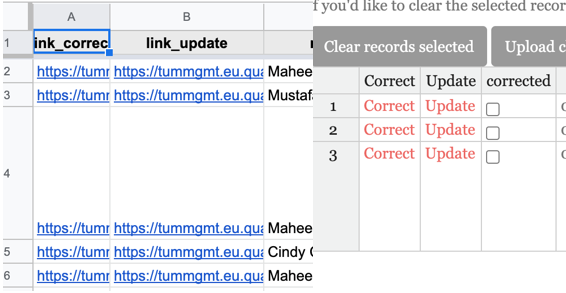{width=50%}</center>


### How do I document a ‘policy’?{-}

The below gives a textual overview of how to document a policy. Please refer to the required general [training on Zoom](https://nyu.zoom.us/rec/share/9cdaCrL_qUFOYbfT5EDxe_I8D7q-eaa82iVNr_APzBuFcffq3OYSOR7NqOaeBScY) for more information.

<span style="text-decoration:underline;">**Use the following checklist:**</span>

  1. For each country, check the data sources, in the order given below in the “Data Sources” section, for relevant information on government policy toward combating the coronavirus.

  2. Enter the relevant information into your country specific dataset. It should always be possible to answer the following request/questions for a particular policy:
      *   What type of entry is this? (e.g. new, correction, update)
      *   Description of the government policy.
      *   What is the policy category? (e.g. travel ban)
      *   From what level of government does this policy originate from?
      *   What kind of enforcement does this policy have (if any)?
      *   Which organizations or entities are in charge of enforcing a policy?
      *   When was the policy announced?
      *   What information sources did you use to identify this policy?
      
      <br>
      Some, but not all policies,[^1] will also require you to identify:
      *   Which geographical entity is the target of this policy?
      *   What or whom is the policy targeted toward?
      *   Is this policy inbound, outbound or both?
      *   What kind of transportation is this policy targeted toward?

      When it is not possible to collect this information, please note the reason for the difficulty  at the end of the survey.
      
      Please document each source by answering the according survey question. Currently, the dataset allows you to code up to 10 sources. Note also that it is possible that you will need more than one source to collect all the information for each event.

  3. Save a .pdf for each data source that you use. As the file name, use the following format: [Date Collected]_[Title of article].pdf where the [Date Collected] should follow the format MM-DD-YYYY.

  4. You can upload the file within the Qualtrics survey (be sure to choose the correct country).


### How do I find a policy?{-}

The rest of this document tells you how to go about finding policies. Of course you can just use your own knowledge and Google, but we have some great resources we’ve identified below you should use to get started.

1. We have a list of policies that are coded in other sources external to the project. This external data should be seen as an additional source of information that we hope will make it easier and faster for RAs to identify policies to document for their country or subnational region. You can check the list of these policies in the **[CoronaNet Data Integration Sheet](https://docs.google.com/spreadsheets/u/0/d/1Aq1ydsjUtfhiOXuqxmX6l1pIOvIxNY5a35iYrBtTE8k/edit){target="_blank"}**. In the section titled “Data Integration” later in this document the entire Data Integration process will be explained in detail.

<hr>

2. **We now have a source of news articles possibly related to the coronavirus by country compiled by the data science company Starsift.** Please see **[this link](https://docs.google.com/spreadsheets/d/1EW-Vsue2fQ7k41gC31hWjIUr290VPDO-0w-Ig_Wh71E/edit?ts=5e865e7d#gid=0){target="_blank"}** for a list of news articles (articles that are more likely to contain a policy are marked in the “policy” column, though all of the articles could contain some information.
Once you’ve worked through that dataset, you should do some searching on your own. Of course Google/Google News is a good asset, but there are other available sources:

<hr>

3. **Check the U.S. Embassy website for your country.**

<div class="tips">
<span style="text-decoration:underline;">**What is this?**</span>

Most U.S. Embassies’ have a designated webpage for disseminatingCOVD-19. Information for a particular country. For example, the U.S. Embassy & Consulates in Germany’s web page for this information can be found [here](https://de.usembassy.gov/covid-19-information/){target="_blank"}.

<span style="text-decoration:underline;">**How to access this source for your country:**</span>

You should be able to find this page for your website by Googling “U.S. Embassy [Your Country Name] COVID-19 Information”.

<span style="text-decoration:underline;">**How to use this source in the dataset:**</span>

The U.S. Embassy’s designated webpage on the coronavirus in a particular countries will often list information on, for example, entry and exit requirements or quarantine information. Often the U.S. Embassy will also link to the primary home government source for this information. 

&emsp;&emsp;***When links to the primary source of information are made available:***
      &emsp;&emsp;&emsp;&emsp;<ol>
                  <li>Click on the link.</li>
                  <li>Corroborate the information from the primary source.</li>
                  <li>Use this link as the primary source of in</li>
                </ol>

&emsp;&emsp;***Use the U.S. Embassy page as the primary source if:***
      &emsp;&emsp;&emsp;&emsp;<ul>
                        <li> There is no link or.</li>
                        <li> The information on the linked page is in a language you do not speak.</li>
                      </ul>

Please especially make sure to save a .pdf of the relevant page for your country for the day you collect the information if  using the U.S. Embassy page as a source because it may update relatively frequently with new information.
</div>
<hr>

4. **Check Wikipedia for your country’s response to the corona pandemic**

<div class="tips">
<span style="text-decoration:underline;">**What is this?**</span>

For many countries, there is a designated Wikipedia page for how a country has dealt with the coronavirus pandemic. For example, the “2020 coronavirus pandemic in the Dominican Republic” can be found [here](https://en.wikipedia.org/wiki/2020_coronavirus_pandemic_in_the_Dominican_Republic.){target="_blank"}.

<span style="text-decoration:underline;">**How to access this source for your country:**</span>

You should be able to find this page for your website by Googling “Wikipedia [Your Country Name] corona”.

<span style="text-decoration:underline;">**How to use this source in the dataset:**</span>

You should treat the Wiki as a platform that aggregates information sources, not as an information source itself. That is, you should **NOT** cite the Wikipedia page as your news source. When entering information from Wikipedia into the dataset, please do the following:

<ol>
  <li>For every claim made on Wikipedia, visit the link of cited source in the footnotes.</li>
  <li>orroborate the information stated on Wikipedia in the information source.</li>
  <li>Add additional relevant information from the primary source to the dataset if you find it.</li>
  <li> If there is no source given for a claim made on Wikipedia or if you cannot corroborate the source, Google it --- if you still do not find a corroborating source, do not enter the information into the dataset.</li>
</ol>
</div>
<hr>

5. **Check Government websites for your country**

<div class="tips">
<span style="text-decoration:underline;">**What is this?**</span>

Different countries will have different government ministries issuing information in response to the crisis. In the course of gathering information on your country from going through the relevant U.S. Embassy and Wikipedia web pages, you may be able to identify the most relevant government ministries for your particular country. For example, the [Taiwan CDC](https://www.cdc.gov.tw/En){target="_blank"} has up to date information on government policy toward the coronavirus.

<span style="text-decoration:underline;">**How to access this source for your country:**</span>

If you have identified the relevant government ministries in charge of responding to the corona crisis for your country, Google: “[relevant ministry or department] corona”.
 
If, however, you have been unable to identify a relevant government body from the relevant U.S. Embassy and Wikipedia web pages, then:

  1. Identify/Google the executive body for your country and your country’s government bodies in charge of health, foreign affairs, or internal affairs and;
  2. Google: “[relevant ministry or department] corona”.

<span style="text-decoration:underline;">**How to use this source in the dataset:**</span>

We consider information that comes directly from the government as a primary source. Identify any relevant information from the government websites and enter them into the dataset.

Please especially make sure to save a .pdf of the relevant page for your country if using the a government page as a source because it may update relatively frequently with new information.
</div>
<hr>

6. **Check Newspaper coverage on the coronavirus in your country**

<div class="tips">
<span style="text-decoration:underline;">**What is this?**</span>

LexisNexis, Factiva are platforms which aggregate, among other things, newspaper articles around the world.

<span style="text-decoration:underline;">**How to access this source for your country:**</span>

Use your home institution to access these datasets.
 
For NYU students, you can do so here:

  * [Factiva](https://persistent.library.nyu.edu/arch/NYU00954){target="_blank"}
  * [Nexis Uni](https://persistent.library.nyu.edu/arch/NYU02479){target="_blank"}

For the Technical University of Munich, you can do so here:

  * [Factiva](https://www.ub.tum.de/en/datenbanken/details/102480){target="_blank"}
  * [LexisNexis](https://www.ub.tum.de/datenbanken/details/1670){target="_blank"}

<span style="text-decoration:underline;">**How to use this source in the dataset:**</span>

You can search these articles for different search terms such as “quarantine” and “travel ban” to see what pops up and when. Please limit your search to December 31, 2019 (when China first reported the coronavirus to the WHO) to the present.
 
We consider information that comes from newspaper articles as a primary source. Identify any relevant information from the newspaper article and enter them into the dataset. However, if you have doubts or qualms about the rigor of a particular publication outlet, please do not hesitate to raise your concern with us.
</div>
<hr>

7. **Other resources**

We will update this section accordingly as more information becomes available. For now, some other resources you might consider include:

  *   Check Facebook and Twitter accounts for political leaders in the country (or for health ministries).
  *   This is a crowd-sourced list of government actions against the coronavirus by the Open Government Partnership (OGP). Note please be sure to vet the sources here carefully as the OGP themselves do not control for the quality of the entries made [here](https://docs.google.com/spreadsheets/d/1UOdONQoD5wiS2MZW8PEwnEyklDTUZqWKlys3304WKoY/edit#gid=921375421){target="_blank"}.
  *   [This website](https://coronavirustechhandbook.com/data){target="_blank"} is a crowd-sourced compendium of information about the coronavirus. For now these appear to deal largely with the health outcomes associated with coronavirus but may be useful insofar as includes many links to in-country websites.


### What to do if I need to delete an entry?{-}

Please post the entry that you need to be deleted in the [Policy Delition sheet](https://docs.google.com/spreadsheets/d/1OuFhdRryq2in6DfvP2PuKoe5zTWf-kgMo3Z-cBkJWcU/edit#gid=0){target="_blank"} and provide a reason for why the entry needs to be deleted. 

With regards to incomplete records, please note:

  * We DO include in the dataset records for which the RA filled everything out except they didn’t hit the final submit button; all other records are not included.
  * If, however, you are seeing a record in the record sheet that looks incomplete, please let us know (those are supposed to be filtered out before the record sheet is populated). Note however, if the record is is a correction, it may look incomplete because a correction may only correct one part of the original record.

|
|
|

<!-- ## Data Cleaning{-} -->

<!-- ** ** -->

<!-- ### Why are we doing data cleaning?{-} -->

<!-- In parallel to the regular validation process, we need reliable people who can take the responsibility of cleaning our main dataset. As of today, we have over 180,000 policies in the dataset with great granularity. Unsurprisingly, we are sure that some of them have errors and typos. While it will be impossible to correct all of them, we need to make an effort to minimize errors. To do this, we have designed the following cleaning protocol that those involved with data cleaning should follow. -->


<!-- ### What should be ‘cleaned’?{-} -->

<!-- The goal of data cleaning is to clean _clear errors and or typos_ as opposed to conceptual errors. -->

<!-- Clear errors/typos are of the following kind: e.g. the policy is targeted toward ' China, Iran, Singapore, South Korea, or Italy’ but the original coder left out ‘Iran’. -->

<!-- Conceptual errors have more to do with how certain policy types should be coded to match our coding guidance: e.g. is this policy about social distancing or a quarantine? -->

<!-- There will be a gray zone between clear errors and conceptual errors. Please do feel very very free to ask us as many questions as you have about what should be ‘cleaned’ and what shouldn’t be and how to clean it, but for the most part, if you’re finding it difficult to judge if something is an ‘error’ or not,  then leave it alone. -->

<!-- Please pay special attention to the qualitative description, as it should contain: -->

<!-- *   <span style="color:white; background-color: #E74C3C;">The name of the country from which a policy originates.</span> -->
<!-- *   <span style="color:white; background-color: #3498DB;">The date the policy is supposed to take effect.</span> -->
<!-- *   <span style="color:white; background-color: #944DB1;">Information about the 'type' of policy (see buttons below).</span> -->
<!-- *   <span style="color:#3CB56F;">If applicable, the country or region that a policy is targeted towards.</span> -->
<!-- *   <span style="color:#D35401;">If applicable, the type of people or resources a policy is targeted towards.</span> -->
<!-- *   If applicable, when a policy is slated to end -->

<!-- A proper description should contain all the above points where applicable. -->


<!-- ### How do I get started with data cleaning?{-} -->

<!-- The process requires you to follow these basic instructions: -->

<!-- #### Assign yourself a Cleaning Task{-} -->

<!-- 1. Assign yourself to record_ids under cleaned_ra for a country you’d like to clean in the corona_clean [Google Spreadsheet](https://docs.google.com/spreadsheets/d/1nG1gAYwDMNfcSk345Q5ZfAhH9pG5lGSt5vD_lGMdN9Y/edit#gid=505667220){target="_blank"}: -->

<!-- 2. Make sure one of the PIs invites you to the #data_cleaning_ Slack channel.  -->

<!-- <center> -->
<!-- 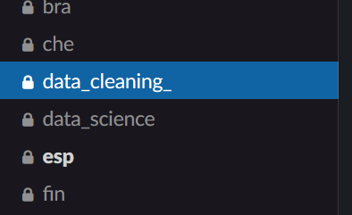{width=30%} -->
<!-- </center> -->
<!-- <br> -->

<!-- #### Download the Data{-} -->

<!-- * If you are using R, you can go to the CoronaNet website and [download the latest version](https://www.coronanet-project.org/download.html?){target="_blank"} of our core dataset (CoronaNet Database BETA Version 1.0 (core)). -->

<!-- <center> -->
<!-- 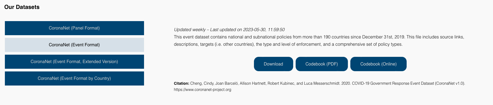{width=80%} -->
<!-- </center> -->
<!-- <br> -->

<!-- * If you are using Excel, you can go to the Google Drive folder with all the .csv files for the countries which will be updated regularly. You can download your country data from either: [This link](https://drive.google.com/drive/u/1/folders/19cRR9cUJiNZK1naEcL8V78GYVvkoIQSN){target="_blank"} or Or from the link in the #general Slack channel or from the Dashboards. -->

<!-- <center> -->
<!-- 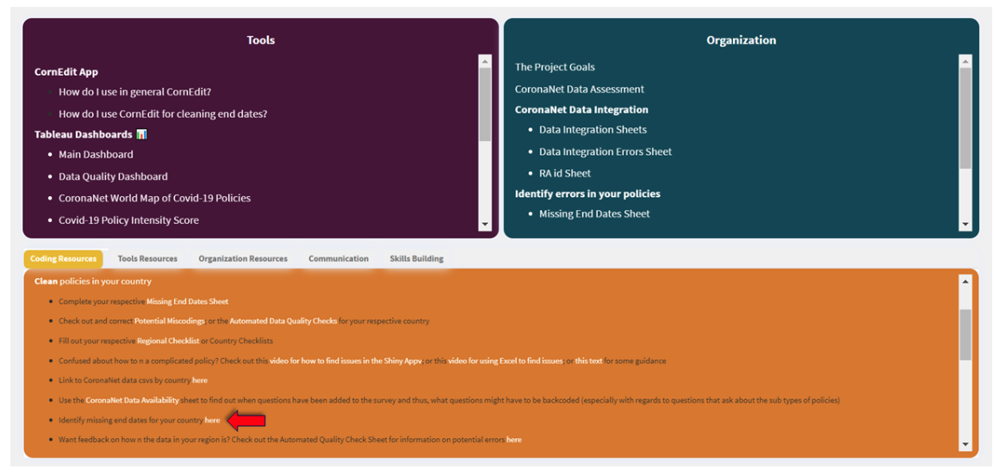{width=80%} -->
<!-- </center> -->
<!-- <br> -->

<!-- #### Clean the Data{-} -->

<!-- 1. In the main dataset, for the observations that you have been assigned to, evaluate whether the information entered across all columns adequately captures the information in the column "event_description." -->

<!-- 2. To check the event description:  -->

<!--     *   Using R, please use the R-Studio code posted in the #data_cleaning_ Slack Channel. For instructions on how to use the code, please watch this [video.](https://corona-govt-response.slack.com/archives/G011RS4L03Y/p1591792230012400){target="_blank"} -->
<!--     *   Using Excel, please use this [Excel guideline](https://docs.google.com/document/d/1qL-R2jBB7P-Y6jc2mC_2AL57jj8mT_dWpMR_dDrEZ2s/edit){target="_blank"}. For visual guidelines on how to get your data organized, you can watch this [video.](https://www.youtube.com/watch?v=QYjLrFjdaYE&feature=youtu.be){target="_blank"} -->

<!-- 3. If you consider that the observation requires no changes, move to the next observation. -->

<!-- 4. If you think that the observation requires being changed, correct the entry using either:  -->

<!--     *   The RShiny App: (Note that the released dataset has one row per target rather than one row per entry, so you need to take that into account when adding a correction). The instructions on how to use the R-Shiny app are also present on the video above.  -->
<!--     *   Qualtrics: Enter Shiny apps and find the entry you want to correct. On the left side of the entry you can click on “Correct” and it will open a link that will direct you to the Qualtrics survey. -->
<!-- <br> -->

<!-- 5. **NOTE: You should not be spending more than a couple of minutes per record maximum, if you’re spending more time, than either ask for guidance in the #data_cleaning_ channel or move on.**    -->
<!-- <br> -->

<!-- #### Dealing with Systematic errors{-} -->

<!-- 6. If, in the process of cleaning, you notice that the original coder is making a systematic error, please: -->

<!--     *   Notify the #data_cleaning channel that this is has happened. -->
<!--     *   After consulting with a PI, please contact the original coder and let them know that they are making this systematic error and ask them if they could please code back, and make the appropriate corrections to their entries. -->
<!--     *   If the original coder is no longer involved in the project or otherwise unresponsive, please let the #data_cleaning_ channel know and we will assign a new RA to address this systematic error. -->
<!-- <br> -->

<!-- #### Finalize a Cleaning Task{-} -->

<!-- 7. Once you have finalized cleaning all the observations that you have been assigned to, please update the “due date” in Trello and move the card to the column on the right to “complete” section. -->
<!-- <br> -->

<!-- ### How do I become a data cleaner?{-} -->

<!-- Data cleaners must possess a deep knowledge of the ins and outs of the survey and data collection process to maintain the integrity of the data cleaning process. Data cleaners must also possess working knowledge of a programming language (preferably R) in order to participate in the data cleaning process. To date, a select few research assistants have been invited to be data cleaners only after they have spent substantial time with data collection and validation. -->

<!-- ### Examples{-} -->

<!-- <div class="tips"> -->
<!-- For example, see policy_id = 6298255: -->

<!-- event_description = 'Albania began health checks at the airport for passengers coming from China, Iran, Singapore, South Korea, or Italy on February 25th'. -->

<!-- 4 rows: -->

<!-- target_country = China (row1) -->

<!-- target_country = Italy  (row2) -->

<!-- target_country = Singapore (row3) -->

<!-- target_country = South Korea (row4) -->

<!-- Our coder forgot to select "Iran" in this entry. Sort the dataset to make sure that Iran has not been added later on (e.g., order the data by "init_country" and "target_country" and search for "Albania" and "Iran"). Once you certify that Iran is missing, go to the main survey in Qualtrics and add a Correction for this record_id where you will be able to correct the target_country so that you select China, Italy, Singapore, South Korea AND Iran. All else equal. Remember to sort the data again by "record_date" so that you ONLY change the observations that have been assigned to you). -->

<!-- Example 2: -->

<!-- policy_ID  5808477 -->

<!-- Event_description: “Nation steps up to COVID-19 Alert Level 2” -->

<!-- This policy is coded under “Declaration of Emergency”, but the description is not precise enough (there is no country name, and no dates) to understand if this policy was coded correctly. In this case we need to refer to the source, check the entry according to the information in the source, then correct the description and other variables if needed. -->
<!-- </div> -->
<!-- | -->
<!-- | -->
<!-- | -->

## Data Validation{-}

** **

### Why do we validate data?{-}

Data validation is required to ensure our dataset is reliable and accurate. At the moment we have over 500 hundred hard working research assistants that are entering more than 17,000 policies, updates and corrections. With so many minds, there is bound to be a difference of opinion and skill on how policies should be coded. This difference gives rise to conceptual errors and policies that have been entered that differ to our coding guidelines. For example, is a policy about quarantining or lockdown? Should a policy be entered as one, or broken down into smaller policies? Ideally, we should have high intercoder reliability, which means that two independent people will code the same source in the same way, but with a complex survey this is increasingly difficult. To increase intercoder reliability, we have designed a validation process.


### How do we validate data?{-}

Validation is split into two main stages; recoding and reconciliation. Recoding is carried out by experienced coders, from a source chosen out of the randomly selected validation dataset. Reconciliation is done by the validation PIs, who take the original policy and the recoded entries and try to find a match, determining if two independent coders, who had the same source, found the same policy and coded it in the same way.

### How do I join the validation team?{-}

1. Send an email to Joan ([joan.barcelo@nyu.edu](mailto:joan.barcelo@nyu.edu)) to signal your interest in becoming a validator.

2. We will then send you a link to a quick test survey that helps us check your coding level. We do this to ensure that everyone who joins the team has a comparable level of coding skills. The score threshold for being added to the validation team is 70% accuracy.


#### Getting started with validation{-}

1. Once you pass the test, Joan  will add you to the ra-validation slack channel.

2.  Pinned to the slack channel is a Google Sheet listing all observations to be validated (also known as the validation dataset) and the link to the validation survey. Click on it and follow the instructions below.


#### Assigning an observation{-}

1.  Look for an observation in the Google Sheet validation dataset that is not assigned to anyone else.

<center>
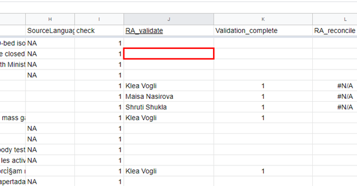{width=80%}
</center>
<br>

2.  Click on the source to see the country/language.

<center>
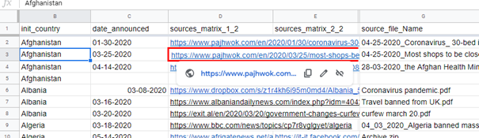{width=80%}
</center>
<br>

3.  If you have the skills to code that observation (and you did not code that observation in the main dataset), then put your name on the RA_validate column in the Google Sheet.

4.	After assigning an observation to yourself, click the validation survey link,  select “Validation” and insert the corresponding “record_id,” which you can find in the spreadsheet. Identify yourself using the dropdown menu. If your name is not in the list, please send an email to  [joan.barcelo@nyu.edu](mailto:joan.barcelo@nyu.edu) and they will add you.

5.  Complete the survey for as many entries as you think it is necessary to have a complete picture of the policies announced in that country on that date from that source - in case of doubt, too many is better than too few.

6.  Once done, put a 1 on the column "Validation_complete".

>**Note:** If the link to a source does not work, is missing, or links to an updating source, please message the PIs in the ra-validation slack channel to ask for the original PDF.


### Second Round of Validation: “Checking”{-}

Every entry in the validation set will be validated twice. The second round of validation - termed checking for clarity - will help us determine the most appropriate coding for each policy. The procedure for checking is _nearly _identical to the first round of validation described above. Two important things to note:

1. You should **<span style="text-decoration:underline;">not</span>** check an observation that you coded in the original dataset.

2. You should **<span style="text-decoration:underline;">not</span>** check an observation that you validated in the first round of validation.

It is important that each round (original entry, validation, and checking) be done by three different individuals. This ensures that our original coding, validation, and checking processes are independent of each other and makes the quality of our data more reliable (statistically speaking)! What follows is a description of how to get involved in checking the data.


#### Getting started with checking{-}

1. You should email Joan with your intention to join the validation/checking team and pass the same coding survey test described in the validation section with a score of 70% or higher.

2. Once you are added to the ra-validation Slack channel, open the validation spreadsheet and look for an observation that is blank or NA in the column "RA_checker".

3. Click on the source/s to see country/language.

4. If you have the skills to code that observation (and you did not code that observation for the main dataset and for the validation dataset), then put your name on the RA_checker column (you are assigning this observation to you).

5. After assigning an observation to you, then click on the survey link and complete the survey for as many entries as you think it is necessary to have a complete picture of the policies announced in that country on that date from that source---in case of doubt, too many is better than too few.

6. Please, find your name in the list of contributors within the Survey (if your name is not in the list, send an email to  [joan.barcelo@nyu.edu](mailto:joan.barcelo@nyu.edu)).

7. Select "Checker Entry" from the multiple choice options and enter the record ID that you are checking.

8.  Once done, put a 1 on the column "checker_complete".
<br>

## Data Integration{-}
 
** **

This section contains instructions for data integration. Before reading this, you should make sure you have access to: 

<div class="tips">
<div class="tips-header">&#128161; **Check out these links!**</div>
* [CoronaNet Data Integration Guidelines](https://www.coronanet-project.org/data_integration_guidelines){target="_blank"}.
* [CoronaNet Data Integration Training Video](https://www.youtube.com/watch?v=hx7ppuBSX9w){target="_blank"}.
* [Data Integration Links spreadsheet](https://docs.google.com/spreadsheets/d/1Aq1ydsjUtfhiOXuqxmX6l1pIOvIxNY5a35iYrBtTE8k/edit#gid=0){target="_blank"}. 
</div>
<br>

#### What is Data Integration?{-} 

Data integration is assessing the overlap between data external to CoronaNet and recoding data that is currently missing from CoronaNet into the CoronaNet taxonomy, while giving proper attribution to the original coders. To see the list of external datasets we are integrating data from, see the [Data Integration Guidelines](https://www.coronanet-project.org/data_integration_guidelines){target="_blank"}.There are in total around 150,000 policies that we have identified in the external data which we can potentially integrate into the CoronaNet dataset. We have done our best to map this external data to the CoronaNet taxonomy but there are some things that we cannot control and we need your help to work through. 

The external data should be seen as an additional source of information that we hope will make it easier and faster for RAs to identify policies to document for their country or subnational region. However, like all sources of information we use, we still need to vet this information carefully before incorporating it into the CoronaNet data. While there are around 150,000 observations in the external data, that doesn’t mean we aim to increase the CoronaNet database by 150,000 observations. This is for a variety of reasons.
<br>


#### How to integrate data?{-}

First of all, make sure you read the Data Integration Guidelines and you have access to the CoronaNet Data Integration Sheet:

1. Identify data that other datasets have documented but which are not currently in the CoronaNet dataset. Fill in this information in the overlap_assess column in the CoronaNet data Integration sheet.

<center>
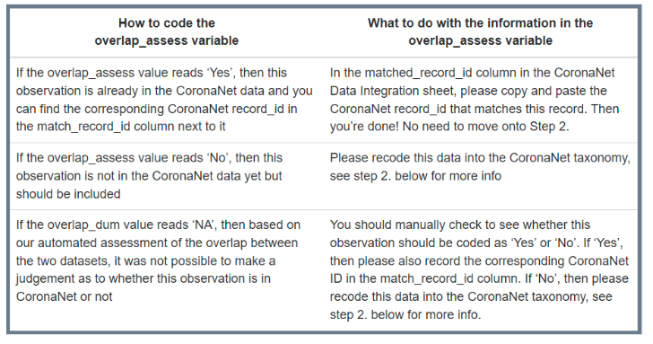{width=80%}
</center>
<br>


2. Recode the data that is not currently in CoronaNet:

    a. To recode this data, RAs should adhere to the following steps:
        
        i. Identify policies that are not currently in the CoronaNet dataset by searching for rows that have the value ‘No’ in the overlap_assess column
        ii. Click on the ‘link’ or ‘pdf_link’ for that observation and read through the information in the raw data source.
        iii. Code the information that you find in that link into the CoronaNet Qualtrics survey. You can use the other column information which maps in the CoronaNet Integration Sheet as a guide for how you can code certain fields.
        iv. At the end of the CoronaNet Qualtrics Survey, you will be asked two questions:
            
            1. [collab] “If (one of) the sources that you used to document this policy came from another dataset, please note which dataset’ ➪ Information about the dataset that you are integrating will be found in the ‘data’ column in the CoronaNet Data; if you used a source/link that you yourself found, please choose ‘I found this source myself’ instead.
            2. [collab_id] ‘Please copy and paste the unique id of the record that you used from the other dataset in the text entry below’ ➪ If you use a source from an external dataset, in this field, copy and paste the ‘unique_id’ found in the ‘unique_id’ column for this observation found in the CoronaNet Data Integration sheet.

        v. In the ‘integrated’ column in the CoronaNet Data Integration sheet, please choose one of the following:

            1. ‘Integrated’; this means you have identified a policy that was in another dataset and recoded it into the CoronaNet taxonomy.
            2. ‘Integrated with additional original research’: You may have to do some additional research for any number of reasons. E.g. the information that you receive from the link or pdf_link of the external dataset may be unclear or require additional context/knowledge to code well. In such cases, please note what additional research you had to do in the ‘Notes’ column and click this option.
            3. ‘Integrated with additional work to find a new link’ means that the original link for the policy as noted in the CoronaNet Data Integration sheet is dead but that the RA was able to find a new link that corroborates the information described in the ‘description’ column. In this case please choose ‘I found this source myself’ option in 2.4 and click this option in the data integration sheet. Note that if you were able to find the information from the original link using the [Way Back Machine](http://web.archive.org/){target="_blank"} then choose the ‘Integrated or ‘Integrated with additional original research’ option as appropriate.
            4. ‘Integrated with additional original research AND with additional work to find a new link’: means fulfilled both the criterion under: ‘Integrated with additional original research’ and ‘Integrated with additional work to find a new link’. See above for more information.
            5. ‘Duplicated policy’: this means that there were multiple external policies that were duplicates of each other. In this case, please only integrate one of them (and choose one of the ‘integrated’ options above). When you click this option, this means you do not integrate this particular policy because it is a duplicate. If the data is already in CoronaNet, pick one policy to mark as ‘Yes’ in the overlap_assessment and find the corresponding record_id to paste into the matched_record_id column. In general, for duplicated data, the overlap_assessment should be ‘No’.
            6. ‘Not a relevant policy’: this means that after having taken a closer look at the link for the observation is not one that we would code in CoronaNet. The corresponding overlap_assessment should be ‘No’ in this case.
            7. ‘Link dead, no other link found’ means that the original link for the policy as noted in the CoronaNet Data Integration sheet is dead and the RA was unable to i) use the [Way Back Machine](http://web.archive.org/){target="_blank"} to find the original data ii) find another link to corroborate this information. In this case, please do not recode this data.

This might seem like an overwhelming process at first so don’t worry if you make a mistake. Check out the [Data Integration Errors sheet](https://docs.google.com/spreadsheets/d/11I9636EuNVoBLK3Hood0qZ4zkq3NjTcAXLFIpqOqbMI/edit#gid=1583171788){target="_blank"} to see if you might have made an error and get credit for your work when the mistake is fixed!

Please make sure to read the [Data Integration Guidelines](https://www.coronanet-project.org/data_integration_guidelines){target="_blank"} for further tips and things to watch out for when doing data integration.

|
|
|

## Data Science Team{-}

** **

The data science team exists to manage the export and cleaning of Qualtrics survey data, and also to visualize and analyze the data. This team is led by Tim Model (Chief Data Scientist) and Cindy Cheng. The members of this team may have some data entry responsibilities but their primary goal is to ensure that our data pipeline is as smooth as possible, and also to employ data-analytic tools to check the data and extract insights.

Regular tasks assigned to the team include:

1. Daily exports of the Qualtrics data to our Github site, including cleaning the data, uploading for the RA record sheet/RShiny Data Validation App.
2. Retrieving changed records from the RShiny Data Validation App and merging into the released data.
3. Maintenance of the RShiny Data Validation App.
4. Help with adjusting the Qualtrics JavaScript backend.
5. Extract insights from the data through analysis and visualization.
6. Monitoring the #orphaned-records channel and adding deleted records to removal lists (and also identify any record issues outstanding).

The data science team currently consists of five groups:

1. Qualtrics: developing, managing, and maintaining the Qualtrics survey.
2. Data Pipeline: data cleaning and wrangling, as well as releasing data to record lookup, AWS, and public Github repository.
3. Shiny App: developing, managing, and maintaining the Shiny app used for data validation by RAs.
4. Issue Triage and QC: identifying source of errors reported in Slack and elsewhere, including bad record IDs .
5. Data Visualization: developing visualizations for public-facing presentations of our data.

If you are interested in joining the Data Science team, please message Tim Model or Cindy Cheng on Slack.

|
|
|

## Qualtrics{-}

** **

Once an RA is onboarded, they will receive a link to the Qualtrics survey they should use to enter new records.

RA’s should select their name from the drop-down list (Hint: typing your name once the drop-down list is open makes it easier to find yourself in the list).

The **[CoronaNet Data Codebook](https://docs.google.com/document/d/1zvNMpwj0onFvUZ_gLl4RRjqS-clbHv3TIX6EOHofsME/edit?usp=sharing){target="_blank"}** can be used to help fill out the Qualtrics survey.

The penultimate page of the Qualtrics survey is a review of all the information about the policy that has been entered, RA’s should scroll down and read this page before finally clicking on the ‘advance arrow’ to ensure the entry gets submitted to the dataset.

**How to retrieve a PDF Source?**

If you are working on validating an entry, you can request a PDF source by posting in the #ra-validation channel and someone with access to the survey will retrieve it for you. You can also use [this list](https://docs.google.com/spreadsheets/d/1khoRcd-P6vE9MjY3BO7YH-ZvGlPXsEqRIlueqZYMw_E/edit#gid=0){target="_blank"}, which will take you to your countries PDF source list.

Note that only those with permission to view/edit the Qualtrics survey will be able to retrieve a PDF Source. You will only be granted access if you are actively working on editing the Qualtrics survey or actively working on the raw Qualtrics output. Validators should not request to view the raw survey, as this will compromise the blind validation process. 

If you do have permission to view/edit the survey, you can retrieve a source by following this procedure:

Click on the dataset > Data & Analysis > Add Filter > Embedded data, record ID > Once you have the record you want, click Export & Import > Export > User Submitted Files. This will produce a .zip file of the desired source pdf(s) for that record ID.

|
|
|

## Slack{-}

** **

### What is Slack?{-}

Slack is a collaboration software tool that enables users to share messages, tools, and files with their fellow team members.

It helps increase productivity amongst large, remote teams and saves everybody from getting lost in endless email chains.

### Key Functionalities{-}

_<span style="text-decoration:underline;">**Channels**</span>_

Channels are where the work happens!
 
Each different part of the project has its own dedicated channel, where all the people involved in that part can easily communicate.
 
All the messages shared in these channels are searchable, so you will never lose out on information.

<center>
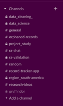{width=30%}
</center>
<br>

_<span style="text-decoration:underline;">**Threads**</span>_

If somebody posts a message in a channel that you want to add to, start a thread specific to the original message.

<center>
![](images/manual_img/9. Slack threads.png{width=70%}
</center>
<br>

_<span style="text-decoration:underline;">**Direct Messages**</span>_

Perhaps you need to contact somebody within the project personally, but there is no need for a specific channel, utilise the direct message function instead.

<center>
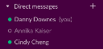{width=30%}
</center>
<br>

_<span style="text-decoration:underline;">**Notifications / Mute Channel**</span>_

Maybe it’s the weekend or you’re taking a break; pause all notifications here!

You can also customize notification settings or mute specific channels by clicking on the ‘Details’ tab of the channel.

<center>
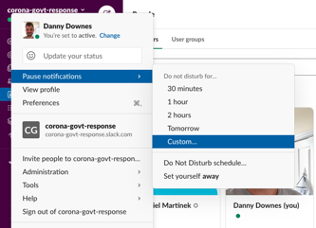{width=40%}
</center>
<br>

You can also customize notification settings or mute specific channels by clicking on the ‘Details’ tab of the channel.

<center>
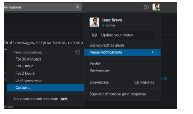{width=40%}
</center>
<br>

_<span style="text-decoration:underline;">**Pinned Items**</span>_

Important/useful messages in a channel may be ‘pinned’.

‘Pinned’ items can be viewed here!

<center>
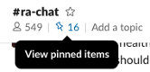{width=20%}
</center>
<br>

### CoronaNet Workspace{-}

All the information you need regarding the CoronaNet project can be found in our Slack workspace. In the rare circumstance you can’t find what you’re looking for, there will be somebody on-hand in Slack to help you answer your question.
 
Queries regarding policy coding, data validation, data cleaning, existing records, using the CoronaNet app, Hogwarts houses, Zoom team meetings, even birthday wishes for your CoronaNet colleagues, can all be found in Slack. It is the beating heart of CoronaNet!
 
Slack workspaces have subsets of different channels, the more aspects of the project you are involved in, the more channels you will be invited to join.
 
To help you navigate your way through the different channels, below you will find a brief summary of each one.

**`#` random**
With such a global team, spread across multiple time-zones, it’s impossible for us all to gather around the water cooler for a short conversation. Utilise this channel as a substitute! Also, a good place to wish people a happy birthday!

**`#` shinyapp-cornedit**
Direct any question you have about the Shinnyapp here

**`#` orphaned-records**
Use this channel to talk about any records you are having trouble locating (or otherwise need help with).

**`#` research-ideas**
An open forum where you can share any research ideas you may have as you are entering data. Have you noticed anything peculiar / interesting / innovative about certain Countries / Regions approach to policy making? This is the channel to share those thoughts in.

**`#` Country / Region**
Once you are assigned a Country to work on, you will be invited to the corresponding channel. These channels are a platform for you to coordinate with the other RA’s working on the same Country / Region as you and provide an easy way for you to contact your Country/Regional Manager regarding any specific questions you have.

**`#` Gryffindor / `#` Hufflepuff / `#` Ravenclaw / `#` Slytherin**
Once you are registered as a member of CoronaNet, the sorting hat will assign you a house! Use this channel to meet your fellow house members and consider it an additional support resource for any questions you may have.


### Slack 'Office Hours'{-}

We have Slack ‘Office Hours’ in the  #ra-chat Slack channel from 8am CEST to 4pm CEST every day to answer your questions and provide feedback (while we may also be on at other times, we are making a commitment to being there during those times in particular). Please feel free to post to the channel in off-hours as well! We will get to your questions and comments as soon as we can.  

We  have some great RAs who have been working with us on this project for a long time who will be stepping in to help out with the #ra-chat questions, they are:

* **Monday:** Marco Waldbauer and Hans-Peter Novak.
* **Tuesday:** Paloma Laye and Kader Saigili.
* **Wednesday:** Celine Heng and Silvia Biagioli.
* **Thursday:** Whitney Burkes.
* **Friday:** Isaac Bravo and Jurgen Kadriaj.
<br>

> **Note** that a PI will always be monitoring these exchanges and a PI might step in if there is a tricky question, but you’ll be in very competent hands with the team above!


## Shiny Web Application Guide{-}

** **

In this section, we describe some of the useful features and tools of the web application for updating records, in addition to providing some helpful background for how it works.

### Shiny App{-}

The Shiny App can be found [here](https://kubinec.shinyapps.io/corona_validate/). In order to access the app, you will need to get permission. You should get a message from “shinyapps.io” in your email to get access to the app. Please search your email for “shinyapps.io” if you did not receive the invitation. If you still do not receive one a few days after joining the project, please message in the #record-tracker-app channel on Slack.

**What do I use the app for?**

You can use it to:
<br>
*   Make corrections to policy entries (NOT updates)
*   Find links to make corrections or updates to a policy entry
*   Look at what policies have currently been entered for certain countries
*   See a timeline visualization of policies
*   Find FAQs for internal use about the project

**How often is the data updated in the app?**

The data is updated approximately every 24 hours. In the “Recorded Data” section of the app, it will note the most recent data currently in the app.

<center>
.png){width=60%}
</center>
<br>

**How do I use the app?**

You can filter the data in the Policy Table in the app in two ways:

1.    You can use the filters for country, RA name, policy type, etc.
2.    You can click on a policy in the Timeline Visualization.

**Filtering using country, RA name, etc:**

1. Select the Country and/or City/Province of the records you are trying to locate (one or more Countries can be selected simultaneously). You MUST select at least one country.

<center>
.png){width=70%}

.png){width=70%}
</center>
<br>

4. “Timeline Visualization” shows the timeline in which the policies are active, and can be used to monitor ongoing policies and see if they need to be updated/ended.

<center>
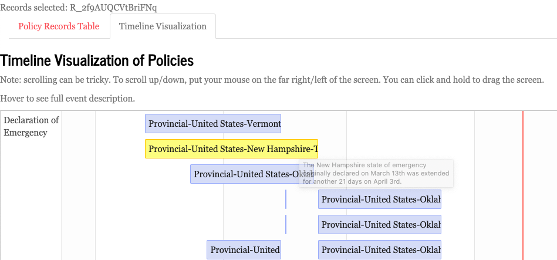{width=80%}
</center>
<br>

  *   By hovering the cursor over one of the blue tiles for a few seconds, the record description will appear.
  *   By clicking on one of the blue tiles, that record will become ‘selected’. The record_id’s of the policies selected by the user will appear at the top of the page (top left of the screenshot above).
  *   If the user then clicks on the ‘Policy Records Table’ tab again, only the records selected by the user will now be visible in the list (as shown below).

<center>
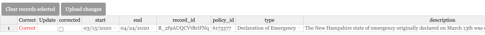{width=80%}
</center>
<br>

  *   Utilise the ‘Clear records selected’ button to clear this filter and repeat the process from the beginning.

<!-- ### Cornedit{-} -->

<!-- Cornedit allows you to edit and clean the data in a more simple way than Qualtrics. Meanwhile though  Shiny is great for visualizing the data, the actual editing is simpler using Cornedit. Through it, all RAs have the ability to edit basic but very important parts of the dataset. Given the wide spectrum of changes that this tool provides it is very important that before using it, you have watched the training video on how to use Cornedit, which you can find [here](https://www.youtube.com/watch?v=GsmJ7uY8_-Y){target="_blank"}. If you have any questions please reach out to your Regional or Country Manager. -->

<!-- To use Cornedit you need to register through the link you were sent. If you have not received it, please contact Project Management so they can arrange your access. Once you register and log in, you will be able to see the following screen: -->

<!-- <center> -->
<!-- {width=80%} -->
<!-- </center> -->
<!-- <br> -->

<!-- <div class="tips"> -->
<!-- <div class="tips-header">&#128161; **Note**</div> -->
<!-- Sometimes it will display a gray screen with the text “disconnected from the server”. If this happens, simply reload the page and that should get it to work. It sometimes takes a couple of tries. If this still does not work, contact the project management team. -->
<!-- </div> -->

<!-- Once you see the screen you can select the country and policy type you wish to check and/or correct by selecting them in the filters. After you select what you wish, the corresponding entries will be displayed in the list below the filters: -->

<!-- <center> -->
<!-- {width=80%} -->
<!-- </center> -->
<!-- <br> -->

<!-- You can scroll through the list and once you find the entry you want to modify, you select it by clicking on it and then click on the “Edit” button at the top of the list, beneath the country filter. After selecting the entry for editing, this window will pop up which will allow you to modify various aspects of the entry: -->

<!-- <center> -->
<!-- {width=80%} -->
<!-- </center> -->
<!-- <br> -->

<!-- When you are satisfied with the changes save them and they are not yet saved to the database. You can review your edits in the ‘View Edits’ tab and when you’re satisfied, click the blue ‘Upload to database’ button on the left hand side of the app  in order for your changes to go through. You can then click the ‘Download Updated Date’ button if you want to see if your changes when through.  -->

<!-- If, after reviewing your edits on the ‘View Edits’ tab you are unsatisfied with them and you have not yet clicked ‘Upload to database’, you can click the ‘Reset’ button on the left  hand side of the app and the changes you made will revert.  -->

<!-- Through Cornedit it is also possible to delete policies. You can do this by selecting the policy you want to delete and then clicking on the ‘delete’ button at the top of the list. A pop up window will appear where you can again click on ‘delete’. This will delete the record for the session you are on. You can double check which policies you have deleted by clicking on the ‘View Deleted (Current Session)’ tab at the top of the page. Be careful when deleting policies but in case you make a mistake, don’t freak out. There is still a failsafe that allows us to restore deleted policies. But for that you need to go to the ‘View Deleted (Current Session)’ tab and take note of the policy_id of the entry you want to recover. It is also possible to go back and check older deleted records in the ‘View All Deleted” tab so that in a worst case scenario, it is still possible to go back and check. -->

<!-- Please take into account that this is a very powerful tool and gives you the possibility of making important changes to the database. Before using Cornedit, make sure you have watched the [video on how to use it](https://www.youtube.com/watch?v=GsmJ7uY8_-Y){target="_blank"} and remember, with great power comes great responsibility! -->

<!-- **Any questions regarding these apps please direct towards the `#`shinyapp-cornedit slack channel.** -->

|
|
|

## Project Administration{-}

** **

### Organisational Flow Chart{-}

[Click here for high resolution version](https://drive.google.com/file/d/13f9kqLVbxOncZQGEyfCuUM8My6pd_0ui/view?usp=sharing)

<center>
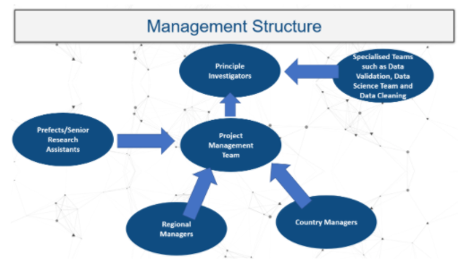{width=80%}
</center>
<br>

* **All questions about how to do something in the project/where to go to help, please contact the prefects.**
* **Any questions about your region, sources for entering your policy or if you need a break, please contact regional managers.**
* **Please see the table on the next page for name of contacts.**

<center>
<!-- {width=80%} -->
<!-- {width=80%} -->
<!-- {width=80%} -->
<!-- {width=80%} -->
<!-- {width=80%} -->
</center>
<br>


CoronaNet organizes its coding in regions and countries. Find out what region your country belongs to by checking out the map below or visiting [this link](https://www.coronanet-project.org/region_grouping_map){target="_blank"} for an interactive version of this map!

<center>
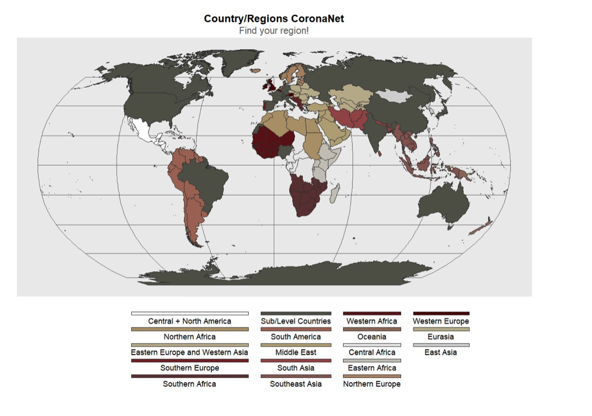{width=100%}
</center>
<br>

## PI Responsibilities{-}

** **

The Principal Investigators (PIs) are in charge of charting the overall course of the CoronaNet Project and for providing guidance and direction for RAs working on different parts of the project. They are also the points of contact for collaborations with other research endeavors or for handling media requests.

In addition, the PIs also take responsibility over certain parts of the project:

**Main Qualtrics Survey**

Cindy takes primary charge of making changes to the main Qualtrics survey in consultation with the other PIs.

**Data  Validation**

Joan Barcelo  

Cindy also provides support for the cleaning process and makes changes to the validation survey to mirror the changes made to the Qualtrics survey

**R Shiny App**

Robert Kubinec

**Project Management**

Luca Messerschmidt


## Task Force Managers Responsibilities{-}

Task Force managers are responsible for providing oversight and support for the specific tasks their group is focusing on.   

#### Organization{-}

*   Task Force  will be added to the #task-force-managers Slack channel.
*   In addition to the weekly meetings that Task Force managers should have with the RAs under their supervision (see more below in the ‘Key Responsibilities’ section), there will be periodic meetings for task force managers to provide feedback and exchange information with each other and the PIs. These meetings will be announced in advanced in the #task-force-managers Slack channel.


#### Scope of Responsibilities{-}

*   Task Force managers are responsible for fulfilling the ‘Key responsibilities’ listed below for their given task areas 

### Onboarding new RAs{-}

**Assess, Plan, Code, Clean!**

Doing data collection and entry requires having knowledge about 1) what the policies are in the region that you are responsible for and 2) how to document those policies in our survey instrument. To get a handle on both of these issues, it helps to first **assess** what the policies are in the region you are coding, make a **plan** for how to code them in the survey, **code** the policies into the survey and **clean** any previous entries or inconsistencies in the data. In the below, we provide more guidance on what this all means: 

**Assess**

In order to assess the current state of the data and to learn more about their country before they start coding, RAs are asked to create a country overview template. This enables everyone to get a good understanding of the policies that have already been entered in their country/region, so that there is no duplication of policies, to see what policies might need to be ended or updated and also what policies have not been entered at all. This should be finished and sent to the Regional Manager within 7-10 days.

* **[Video](https://tum-conf.zoom.us/rec/share/qnbb_bzGMllKWYqEb6IqE_498K_V902RYPE5bo78v11S8Wp-3dmR5l-zT2JQHA-O.zHDV3DOhsmw0dxgv){target="_blank"}** how to fill out country overview template (Password f5G6^AY7).
* Shinyapp **[guide.](https://docs.google.com/document/d/1MgZ5KSll-KGRlIJEot6j-SOgLac8C5og_3K5S_nAYZA/edit){target="_blank"}**
* How to use the Shinyapp **[video.](https://www.youtube.com/watch?v=LUKIw3ntleI&feature=youtu.be){target="_blank"}**

**Plan**

Next RAs are asked to create a plan for how they want to enter their first policies. This helps see how policies are connected to each other with updates and gives the Regional Manager a chance to offer some feedback and tips on how to better code policies. Once the plan is submitted to the regional manager, they will set up a zoom or skype meeting for some one-on-one feedback. 

* **[Timeline Template](https://docs.google.com/document/d/1UCy4Cr59cUlj0Uog6R9NB2DOF8i8ky8sUE48Fq6F_Yw/edit#){target="_blank"}** to help plan.
* **[Video](https://www.youtube.com/watch?v=vbZZ8WgNEKQ&feature=youtu.be){target="_blank"}** on how to fill out the Timeline Template.

**Code**

The process of coding policies is different for every country and region, some countries have relatively straight forward policies and others have fine grained and confusing policies. When in doubt on how to code a policy, we recommend that RAs: 

* Ask their question in the ra-chat, regional/country channel, or ask their regional or country manager.
* Check out the **[coding guide.](https://www.coronanet-project.org/coding_guide.html){target="_blank"}**
* For more general support check out our Zoom **[hangout room](https://tum-conf.zoom.us/j/92401524948){target="_blank"}** where RAs can code together or have a chat (Password 12345).

**Clean**

In order to achieve the project goal of having clean and complete policies up until October 1, 2020 by our deadline of January 1, 2021 we are focusing on cleaning different policy types each week. RAs are to fill out their regional/country checklist once a week. This checklist breaks the cleaning process into small tasks for each policy type. 

* Regional country [checklist.](https://docs.google.com/spreadsheets/d/1RL0Go-ULJxSHrFsJcS521Zzdo1j6E-vlWQd72VD4bUM/edit#gid=199800469){target="_blank"}
* [Video](https://tum-conf.zoom.us/rec/share/gyGEk0OOn0U3Q_ppE9u-_mAe_5dqcDany19OfLCdcOAs3pYOrygYYDZD0IK2PF-j.66KrNjLYx4TTn1A1){target="_blank"} on how to fill out the checklist (Password tCQ0%8wC).
<br>

All these links, resources and more can be found on our [CoronaNet Research Assistant Dashboard.  ](https://www.coronanet-project.org/dashboard#main-dashboard){target="_blank"}

#### Key responsibilities{-}

1. Once a month please fill out the [RM/CM Monthly Survey](https://tummgmt.eu.qualtrics.com/jfe/form/SV_9ow8HYFk3lg4l38){target="_blank"} where we ask you some basic questions about what goals you’ve set for your country or subnational region and how RA activity has been like _for each country or subnational region_.
    a. Each manager should feel free to fill out this survey separately for just the jurisdictions they are responsible for. If this is the case for you, just choose the number of countries/subnational regions that you are responsible for in the dropdown menu.
    b. It may be the case that because there is no RA currently active in a given country or subnational region, it makes no sense to report goals. There is an option in the survey for this situation. 
    c. Finally, in the next survey we will send around next month, we will ask you about your progress towards your goals. At that time, you will also be given the option to adjust your goals depending on how it went over the last month.
    d. Additionally, please contact the project management team to provide any additional information that you think is important to report. This can include:
        i) Whether there are any inactive RAs in your group.
        ii) Whether there are any country reports or research notes you would like to be posted to the website.<br>

2. Check for up-to-dateness. This involves providing information about when an RA was last able to code policies for their country/region.
    a. By ‘up to date’ we mean, just knowing about when the last time it was that an RA was able to look at a particular country in a given week. It is fine if they didn’t have time, just having the information is in itself valuable
    b. Please have the RAs under your responsibility fill out the [excel sheet](https://docs.google.com/spreadsheets/d/1gNvxWSrAdrM2aj7JyQKlAdQNdBkl7kDMOdJWSZBjvj0/edit?pli=1#gid=0 ){target="_blank"}: noting when they were able to document policies for a particular country.
        i) They should open the “ ‘Policy Up-to-Dateness” tab and use the pop-up calendars to indicate when they last updated policies for each of the policy areas.
    c. If the work is not up to date, please make sure that you know the reason why.
        i)  If the RA does not have time for a given week but is otherwise stated a commitment to the project, then note this in the excel sheet by filling in “On a break” in the “Are the RA’s Active?” column.
        ii)  If the RA is unresponsive/no longer active, these tasks may need to be reallocated. You may also nudge and message or nudge RA in your region to be more responsive. <br>
        
3. Check for completeness and/or accuracy of records.
    a. By ‘completeness’, we mean assessing, to the best of your ability, whether
        i)  All policy types for a particular region are coded:
            1. For example, maybe there are no policies about restrictions of mass gatherings because a) the RA didn’t code it or because b) there are simply no policies created by that government. Part of your job as a regional manager would be to communicate with the RA and figure out if the issue is a) or b).
        ii) Each policy type is appropriately coded over time:
            2. For example, it may be the case that there are multiple policies about ‘restrictions on mass gatherings’ that overlap over time. This may be because a) the government has implemented sequential updates to one policy about restriction of mass gatherings such that the policies should not in fact, overlap in time and corrections need to be done to fix the timeline of a given policy or  b) the government has implemented multiple policies for restrictions of mass gatherings that should indeed be coded separately and there is no adjustment that needs to be made. Part of your job as regional manager would be to assess if the issue is a) or b) and communicate with the RA as necessary.
    b. The RShiny App is primarily useful for comparing policy types and countries to pin down which policy types in which countries appear to be out of date. You can also use it to see if policies are no longer enforced (end date has passed) but may still be in force, and which policies are in force but may have expired.
    c. Document the completeness of the records for each week in the [excel sheet](https://docs.google.com/spreadsheets/d/1gNvxWSrAdrM2aj7JyQKlAdQNdBkl7kDMOdJWSZBjvj0/edit?pli=1#gid=0){target="_blank"} in the ‘ ‘Policy Completeness Form’. Note we expect that checking for ‘completeness’ will be a medium-term task, such that in the beginning, it might take one week to check the completeness of a just a few policies such that it might take 4-6 weeks to do an initial assessment of the completeness of the policies for the regions under the regional/country managers’ purview. After this initial assessment is done, going forward, assessing completeness should take less time/be comparable to the time it takes to check for up-to-dateness. This is a ‘joint’ task in that both RAs and regional/country managers can fill in this spreadsheet, but regional/country managers are responsible for verifying the RAs ‘completeness’ assessment.
    d. If the work is incomplete, contains errors or requires attention, please contact the RA directly to resolve any issues. If the RA is no longer active, these tasks may need to be reallocated. Regional managers may also message or nudge an RA in their region to be more responsive.
    e. If you find repeated errors with the coding in your region, leave a note in the “RA Activity+Notes” tab.<br>
    
4. Delegate tasks within their region. If a new RA is allocated to their region, they can delegate states or tasks to them as needed.<br>

5. Check and give approval for country reports for their region.<br>

6. Weekly meetings with their team. Each Regional and Country manager should  organize a short weekly Zoom meeting with your team (suggested length of time is half an hour but regional/country managers have flexibility to decide how long they want their meetings to be). Ideally regional and country managers would not go over the updates and completeness line by line in the meeting for each team member. Rather the meeting should be focused on discussing and resolving any issues in terms of the updateness or completeness of regions under your responsibility.<br>

For country managers: to to allocate and designate tasks for their subnational regions, please make use of this [sheet](https://docs.google.com/spreadsheets/d/1cesReaVkn0-w-0kGjgGHX7WHVZqtejbcQAw0SC7VRZ0/edit?usp=sharing){target="_blank"}.


####  **SOPs for Inactive RAs.**{-}

1. Check if the RA is marked inactive in the [RA Allocation Sheet](https://docs.google.com/spreadsheets/d/1qxkKu7gOdt2I0JjgJmviD6EpKdJoP9gU1p5cjOqgONk/edit?usp=sharing){target="_blank"}: If the RA is colored in orange and has number “2” marked in the inactive column, this means that the RA is no longer active with the CoronaNet Project and you should proceed to step 4.
2. If the RA is not marked inactive, message the RA on Slack. If you do not receive a response in a reasonable time, follow up with the RA via email.
3. If there is no response from email or Slack, mark “no” in the “Are All RA’s Active?” column in the “RA Activity+Notes” tab and put their name down in the “Names of Inactive RAs” column.
4. If possible, the task may need to be reallocated to other active RAs.


#### How do I become a regional/country manager?{-}

Research assistants are invited to become regional/country managers based on some combination of their expertise in the region/country, their familiarity with the CoronaNet project and their previous experience managing and coordinating people.

There are a limited number of regional/country manager positions available and when one becomes available, we invite a research assistant to fill the vacancy. Note, while all countries have a regional manager, not all countries have country managers (that is, we do not make a systematic effort to collect subnational data for all countries) though we may expand the number of country managers on a limited basis in the future.

If you are interested in becoming a regional or country manager, or if you would like to take on the country manager role for a country that currently is not assigned one, please contact the project management team at at [admin@coronanet-project.org](mailto:onadmin@coronanet-project.org){target="_blank"}!


<!-- ### Hogwarts Houses and Prefects{-} -->

<!-- As part of the onboarding process each RA will be assigned to a Hogwarts house - Gryffindor, Slytherin, Hufflepuff or Ravenclaw! -->

<!-- Current prefects are: -->

<!-- 1. Hufflepuff: -->
<!--     a. Nadja Katharina Meichle -->
<!--     b. Jaimi Plater -->
<!-- 2. Ravenclaw -->
<!--     a. Samir Kaddoura -->
<!--     b. Berivan Kalkan -->
<!-- 3. Slytherin -->
<!--     a. Tasia Wagner -->
<!--     b. Marco Waldbauer -->
<!-- 4. Gryffindor -->
<!--     a. Shreeya Mhade -->

<!-- Prefects are the leaders of each of these houses. They are responsible for the social onboarding to the project and the general wellbeing of their house members. They are an additional resource for RA’s to direct their questions towards and help RA’s find answers to their questions and/or help RA’s finding the right person for them to direct their questions to. As well as this, they are generally responsible for maintaining the team spirit of their houses and ensuring RA’s have access to the resources they need. -->

<!-- If you are unsure which house you are in, please post on [#ra-chat](https://app.slack.com/client/T010PHG8J6A/C010V8MKHK2){target="_blank"} channel on Slack. -->


<!-- #### Summary of the Main Tasks{-} -->

<!--   -   Evaluation of Applications -->
<!--   -   Allocation of approved applicants to the houses -->
<!--   -   Managing the House Slack Channels -->
<!--   -   Answering their house members questions -->
<!--   -   Generally ensuring the team spirit of their house is maintained -->

<!-- #### Hogwarts House Cup -->
<!-- **RULES** -->

<!--   -   House cup will begin after the weekly meeting and will end at 15:00 CEST the following week (wed-wed), upon which points will be reset -->
<!--   -   Challenges will occur in the #random channel -->
<!--   -   House cup points will be allocated in the #housecup channel -->

<!-- **BASE POINTS** -->

<!-- **COUNTRY & REGIONAL MANAGERS** -->

<!-- 5pts   	Up-to-dateness form -->
<!-- 5pts   	Completeness form -->
<!-- 3pts   	Meeting attendance -->
<!-- Up to 5 points are up to their discretion -->

<!-- **RA-CHAT** -->

<!-- 2pts   	Given for helpfulness -->
<!-- RA in charge of the channel for that day + PIs to give out points, to ensure fairness -->

<!-- **VALIDATION TEAM** -->

<!-- At their discretion. -->

<!-- **HOUSE CUP CHALLENGE** -->

<!-- 2pts   	given per submission by prefects -->

<!-- **PIs** -->

<!-- PIs are able to give points to their discretion -->


<!-- ## How do I become a Hogwarts Prefect?{-} -->

<!-- Becoming a Hogwarts Prefect is an exciting and rare opportunity! It is also a role of responsibility and empathy. -->

<!-- So, first check #general Slack channel. All prefect vacancies are advertised there. Use the channel search function for “in:#general vacancy”. This should filter out the results. -->

<!-- If you see a vacancy, follow the instructions on the advert. This usually involves messaging the person that posted the advert. -->

<!-- If you do not find any vacancies on #general Slack channel, then you should reach out to a member of the Project Management Team at [admin@coronanet-project.org](mailto:onadmin@coronanet-project.org). Let them know that you are interested in becoming a prefect. A member of the Project Management Team will contact you with further instructions. -->


## RA Responsibilities{-}

After an RA has completed their preliminary training (i.e. they have passed the training survey and have been welcomed onto the project), each RA will initially be assigned a cleaning task to familiarize themselves with the data. 

Once the initial cleaning task has been completed, each RA will be assigned a task to work on. They will either continue to deepen their knowledge of the cleaning process or move onto learning about data integration.They will be added to the relevant Task Force channels and should introduce themselves to their fellow RA’s in the task Force

They can use these channels to ask any questions they have about getting started and to communicate with the Task Force Manager. Other resources available are.

*    **[#ra-chat]**(https://app.slack.com/client/T010PHG8J6A/C010V8MKHK2){target="_blank"} Slack channel
*   **[CoronaNet Coding Guide]**(http://coronanet-project.org/coding_guide){target="_blank"}
*   **[CoronaNet Printed Survey]**(http://coronanet-project.org/survey){target="_blank"}
*   More relevant links are found in the ‘Useful Links’ section of the Manual

Once an RA has been assigned a particular cleaning or integration task, they commit to completing and updating the records for that assignment. The RA must also enter information into the task-specific spreadsheets that will be made available to them by the Task Force Manger Manager. This information concerns the date in which they have coded policies up to and the completeness of the records – important information for the Task Force managers and should be updated regularly.

Please focus on coding policies at the national level. Once those policies are up to date and complete, then RAs may focus on gathering subnational data in consultation with your task force manager. Note that in this case --- that is, national policies are mostly up to date/complete and you would like to start focusing on gathering subnational data --- please, in consultation with your task force manager, choose a couple of states/provinces that you would like to focus on first rather than trying to code them all at once. In order to decide which states/provinces to focus on, it may help to first do a little bit of leg work to get an overall sense of how actively certain provinces/states are, and then choose provinces/states based on 1) how active they are 2) how important they are to the country (e.g. by GDP or population). If you would like to make the case for coding all subnational policies for your country, please let your task force manager know. We will then assess the situation and decide if we should assign more RAs and a task force manager for that particular country to capture sub-national policies systematically. 
 
There is no requirement on the number of policies coded per day/week by each RA. Each policy is unique in their approach and we understand that finding and coding policies vary in the time it takes. It is recommended you take your time with your research before coding a policy, to ensure you code as accurately as possible. RA’s should not hesitate in asking questions in the slack channels if they are unsure. If an RA feels overwhelmed and feels they need extra support, they should contact their Task Force Managers to let them know.

RA’s should also participate in the weekly meeting with their Task Force Managers – which will be set up by the Task Force Managers and links posted in the Slack channel.

In addition, RA’s should participate in/watch the recording of the general RA meeting where updates about the whole project are shared. These meetings take place on Wednesdays at 4.30pm CET at this [link](https://nyu.zoom.us/j/58230804 ).


#### Summary of Main Tasks{-}

* Research policies thoroughly and enter them using the Qualtrics questionnaire.
* Based on the number of hours you are asked to commit to the project, we expect RAs to do 25 overlap assessments or 5 coded policies each week. 
* You have to fill out the RA internal and Well Being surveys every 3 months. * When the time comes, you will get the link to the survey via email and it will also be available on the #general channel on slack.
* Keep policy records up-to-date (enter records chronologically in order to make it easier to update/end policies as they develop).
* Attend weekly RA meetings with the CoronaNet team (Wednesdays 4.30pm CEST, weekly).
* Attend weekly meetings with the Task Force Managers (to be set up by the Managers and communicated in Slack).


#### RA points of contact?{-}

*   **Task Force Manager**
    *   Specific questions regarding process in the task force.
    *   General point of contact/support.
    *   Questions regarding the task-specific spreadsheets.
*   **#ra-chat **
    *   Questions regarding how policies should be coded in Qualtrics.


## Need a break? / Vacation{-}

We understand nobody wants to be coding whilst they are on vacation! And there is zero expectation for you to do so, this is a voluntary project and we pride ourselves on our flexibility.
 
If you have a holiday booked and/or need a break due to other commitments, please get in touch with the Task Force Manager for the country you are responsible for and let them know.
 
They can arrange for another RA to cover you whilst you take a break, and ensure that the records remain up-to-date whilst you are away.


### RA Onboarding Process{-}

<!-- In this section, we explain how CoronaNeta’s project management team onboards RAs: -->

<!-- **STEP 0: **Set up the mail account: We are using Amazon AWS which you can access [here](https://coronanet.awsapps.com/mail ). Login/Password: Ask the project management team -->

<!-- Here you will find some folders in the inbox but you just need to care about the folder “RA Registration” (see screenshot). A PI or one of you should put every email from our application form in the RA-Registration Folder - Pending subfolder. All application email will have “Re: Application for Research Assistant Position” in the heading: -->

<!-- <center> -->
<!-- {width=60%} -->
<!-- </center> -->
<!-- <br> -->

<!-- Once the application has been scored by at least two of you, you can put the mail in the sub-folder “Done”. -->

<!-- <center> -->
<!-- {width=40%} -->
<!-- </center> -->
<!-- <br> -->

<!-- **<span style="text-decoration:underline;">Drawing the Registration Process</span>** -->

<!-- <span style="color:white; background-color: green;">**STEP 1: **</span>Students share their interest either via mail or click on the [form](https://form.jotform.com/201172569499062) linked to the [ra_call](https://coronanet-project.org/ra_call.html). If we get any general questions by email about how to apply, send them the following text: -->

<!-- <span style="text-decoration:underline; background-color: yellow;">MAIL 1: </span> -->

<!-- |       Dear XYZ, -->
<!-- | -->
<!-- |       We appreciate your interest to join the CoronaNet Research Group. In these exceptional times it is important to gather data for real-time research. In order to apply and to become a member of the team, please fill out the following form: [https://form.jotform.com/201172569499062](https://form.jotform.com/201172569499062) -->

<!-- |       More information on the research assistant position can be found here: [https://coronanet-project.org/ra_call.html](https://coronanet-project.org/ra_call.html) -->
<!-- | -->
<!-- |       If you have any questions, feel free to contact us! -->
<!-- | -->
<!-- |       Kind regards, -->
<!-- | -->
<!-- |       CoronaNet -->
<!-- | -->
<!-- | -->

<!-- <span style="color:white; background-color: green;">**STEP 2: **</span>Once we get an application in the email inbox, you are going to screen the applications and evaluate them. Please note that the CVs/resumes will only go to the [admin@coronannet-project.org](mailto:admin@coronannet-project.org) email, so be sure to look for the applications there so you can read all the info. -->

<!-- With this in mind, we want at least two of you to read every application and score them on a scale of 1 to 5, with 5 being the highest score possible. We have a [google spreadsheet](https://docs.google.com/spreadsheets/d/1F2IkLcIgsw7JPzJ3sS-DcM5owF-gaoc-35T0pf6vh4U/edit#gid=0) where you can see a record of all the applications: -->

<!-- On the far right-hand side are two columns, Evaluation 1 and Evaluation 2. You can record your score there once you read it (whoever gets to it first can give a score): -->

<!-- <center> -->
<!-- {width=80%} -->
<!-- </center> -->
<!-- <br> -->


<!-- We will then come back and look at the application scores and make a final decision. Once we put a Y in the decision column, you can then send them the following mail: -->

<!-- <span style="text-decoration:underline; background-color: yellow;">MAIL 2: </span> -->

<!-- Dear XYZ, -->

<!-- We are happy to announce that you have been chosen to become part of the CoronaNet Research Project. We are so excited to offer you this opportunity and we cannot wait to start working with you! There are just a few more steps to complete before you can get started.  -->

<!-- You will be involved in the data collection process. The work mainly involves sifting through news reports to identify different policies that the government has enacted to combat COVID-19. You will each be assigned one unique country if you choose to participate.  If chosen, you will be responsible for (1) researching what government policies your country has implemented starting from the beginning of the epidemic and (2) keeping up to date with new government policy actions on a daily basis. -->

<!-- First, we’d like to share a little bit about what to expect from the project. You will be assigned to a unique country and your responsibilities will include gathering historical data on COVID-19 government policy actions for your country, integrating similar data from external datasets, and cleaning existing policies. You will have the opportunity to connect with other RAs working on the same country as well as other people working on the project. Once you have become more experienced, you will have the opportunity to take on more responsibilities within the project and the opportunity to join other fun teams, such as the Data Science Team or the Social Media Team.  -->

<!-- So, let’s get started!  -->

<!-- **Listed below are the next steps to complete:** -->

<!-- 1. Training Videos - You are required to watch the following two training videos: -->
<!--       a. The Onboarding Video - This video will provide an overview of the project, explain the goals and motivation behind the project and it will give  you the tools needed to get started on Data Integration and Data Collection.] -->
<!--       b. Updating Policies - This video will provide insight on how to update policies once they have been coded. This is an important step in data collection, data cleaning and data integration.  -->
<!--       c. Data Integration - This video provides an overview on how to integrate data from external datasets and why we’re doing it.<br> -->

<!-- 2. Interactive Training - Once you’ve watched the above training videos you will be asked to complete the following survey. It is important to note that you must pass the training survey with at least 70% to join the project.  -->
<!--       a. Click here to get started and to pass that survey! <br> -->

<!-- 3. Wow! You’ve made it to step three, this is huge! Once you’ve completed the interactive training, a commitment form will automatically appear. In this form you can give us a little more information about yourself, so that we can assign you a country that fits your abilities the best! After this step, on the following Monday,  we will assign you a country and add you to Slack (our main form of communication). Wahoo! -->

<!-- We do ask that you please complete this training within 14 days of receiving this email. If you are unable to complete the training within this time frame, please send an email to admin@coronanet-project.org. -->

<!-- Some other links to know are our Code of Conduct and our CoronaNet Research Manual. We expect you to follow Code of Conduct during your entire time working on the project. Please also read the CoronaNet Research Manual and feel free to contact this email with any questions, admin@coronanet-project.org.  -->
<!-- <br> -->

<!-- <li>Click here for the Code of Conduct!</li> -->
<!-- <li>Click here for the CoronaNet Research Manual!</li>  -->

<!-- We know this has been so much information at once but we are so excited that you decided to join us on the CoronaNet journey. The two final things are that: -->
<!-- <br> -->

<!-- <li>Every Wednesday there is a general onboarding meeting at 2.30 pm CET. We look forward to seeing you here: Meeting-ID: 659 6652 3057 Password: CoronaNet.</li> -->
<!-- <li>Later in the week there is a coding onboarding meeting (TBA).</li> -->

<!-- We hope that our project will increase the public's awareness and understanding of what policies governments around the world are taking in response to the virus. Thank you for joining this journey! -->

<!-- All the best, -->

<!-- Robert Kubinek, Cindy Cheng, Joan Barcelo, and Luca Messerschmidt -->

<!-- <br> -->
<!-- **If we put a N in the decision column, you can send them the following email:** -->

<!-- <span style="text-decoration:underline; background-color: yellow;">MAIL 3: </span> -->

<!-- |       Dear XYZ, -->
<!-- | -->
<!-- |       We appreciate your interest and application at CoronaNet. We are sorry to tell you that we have decided not to invite you to become a research assistant for our team. This does not mean that you won't be able to use the data (which you can download here:[www.coronanet-project.org](http://www.coronanet-project.org)) or tell others about it (Twitter: coronanet_org). -->
<!-- | -->
<!-- |       We want you to know that your attempt to help us in this project is overwhelming and you are a real hero of this crisis. -->
<!-- | -->
<!-- |       All the best -->
<!-- | -->
<!-- |       CoronaNet -->
<!-- | -->
<!-- | -->
<!-- <span style="color:white; background-color: green;">**STEP 3: **</span>Once people pass the test, they are directed to a [form](https://form.jotform.com/201202703393039) they will need to fill out in order to agree with the conditions of becoming a RA. Luca is going to allocate the participant to a country and connect this person with previous RAs. It can happen that people pass the test but close the tab etc.which will not allow them to enter the form. If people send you a mail with this inquiry, leave it for Luca to check the records and make a decision. -->

<!-- Every time someone fills out the confirmation form, you will also see a record of it in the admin email account. Once you receive such a record, you can then add them to the Slack channel. To do so, go into slack and hit the following button on the bottom left-hand side: -->

<!-- <center> -->
<!-- {width=30%} -->
<!-- </center> -->
<!-- <br> -->

<!-- Fill out their name and email in the dialog box and hit enter. Then go back to the Application sheet and enter the **date in month-day **form into the final two columns showing that they 1) have been added to slack and 2) have passed the test/committed. -->

<!-- Once the RA has been added to Slack you need to add them to the channel of the country or region they have been assigned to. Introduce them in the channel with a brief message and check back to see that the CM/RM has greeted them. It is also important that you add them to the **`#`onboarding channel**, where new RAs can ask questions during their first weeks on the project. Through that channel they will also be invited to an initial coding hour where they will be onboarded on data integration. For this, it is important that there is communication between Project Management and CM/RMs to assign new RAs policy categories to work on during this coding hour.  -->

<!-- <center> -->
<!-- {width=30%} -->
<!-- </center> -->
<!-- <br> -->

<!-- * Also Add them to the **Shiny App** by inviting them via email. Will require access to the Shiny App. -->

<!-- <span style="color:white; background-color: green;">**STEP 4: **</span>Finally, when people are good to go, they need to be allocated to a Hogwarts House. Please check the [allocation sheet](https://docs.google.com/spreadsheets/d/1qxkKu7gOdt2I0JjgJmviD6EpKdJoP9gU1p5cjOqgONk/edit?usp=sharing) if there are people that have not been assigned to houses. While some people will write down their preference in the allocation form, some will just let the sorting hat decide. Please try to distribute the people equally along the houses. After you allocate a RA to a house via the allocation sheet (Column F), add them to your Slack House Channel (this can only be done by the respective prefects). When you have done so, send the applicant a welcome email to your house (be sure to offer to answer any questions they may have!), and add them to your Slack channel. Be sure to finally go back to the application Google sheet and enter the date they were added to your house. -->


<!-- [^1]: -->
<!--      Policies for which you will need to identify this information are those which can be categorized as dealing with: Quarantine, External Border Restrictions, Internal Border Restrictions, Health Monitoring, Health Testing, and Health Resources. Policies for which you will not need to identify this information are those which can be categorized as dealing with: Declaration of Emergency, Restriction of Mass Gatherings, Social Distancing, Curfew, Closure of Schools, Restriction of Non-Essential Government Services, Restriction of Non-Essential Businesses, New Task Force or Bureau. The presumption is that these categories are all targeted domestically. For more information on each of **these** categories, please see the type variable in the codebook.  -->


<!-- | -->
|
|


## CoronaNet Learning Platform{-}

** **

CoronaNet also has a [website](https://lumesserschmidt.github.io/stats_CoronaNet/index.html) dedicated to providing learning resources and free tutorials to anybody who wants to learn the software “R”.

The learning platform offers an introduction to “R” for new users and is paired with webinars and tutorials that utilise the CoronaNet data. So users can learn how to use/import/analyse/visualise data in “R” using the CoronaNet data as we collect it!

|
|
|     
     
     
     
     
     
     
     
