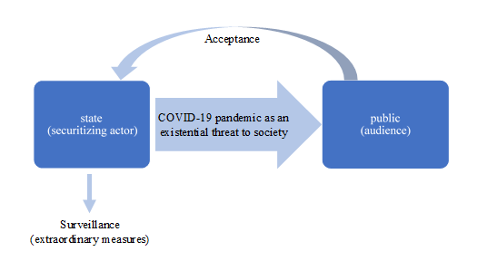
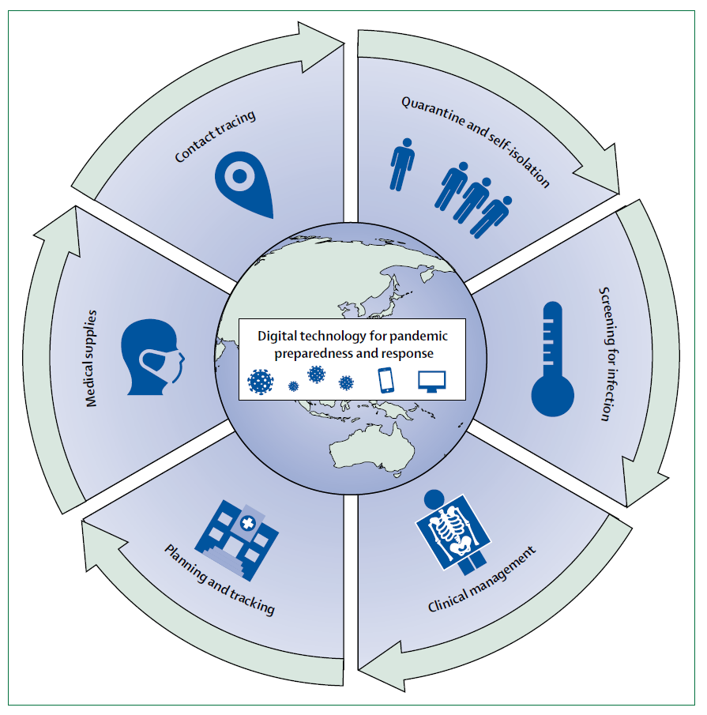

```{r setup, include=FALSE}
knitr::opts_chunk$set(echo = FALSE)
```
<style>
body {
text-align: justify}
</style>


**1 Introduction** 	
Coronavirus (COVID-19) has spread worldwide in 2020 and has consequently been declared a pandemic by the World Health Organization (WHO 2020). Governments have responded to the outbreak with a range of different policies, including the introduction of states of emergency, quarantine and lockdown measures as well as social distancing recommendations and restrictions on mass gatherings (Cheng et al. 2020: 757). In this research note, special focus lies on surveillance mechanisms, established by autocratic and democratic governments, to trace contacts and control the compliance with certain regulations. The common argument in literature is that COVID-19-related surveillance has diminished privacy and ergo has led to a danger of the loss of civil rights and ultimately democracy.	

Brough and Martin (2020:1) “[…] argue that response to the outbreak has threatened privacy by reducing consumer control over the collection, sharing, and protection of some of the most sensitive types of personal information, including health and location data”. Furthermore, Kalinowski (2020) questions the consequences for privacy protection. He reasons that while curfews will be lifted at some point, state-based data collection will most likely continue (ibid.). Hence, Roberts (2020) calls for an active scrutiny “of responses to pandemics, during and after Covid-19”.

Against this background, I analyze what surveillance measures that the People’s Republic of China and the Republic of Korea, as an example for an autocracy and a democracy respectively, have implemented as a response to the COVID-19 pandemic. In particular, how could a democracy enforce surveillance measures, that undermine human and privacy rights? Drawing on securitization theory, I argue that the use of surveillance technology is an extraordinary measure initiated by states. It has been legitimized by the acceptance of the public, where the COVID-19 pandemic has been framed by states as an existential threat. I will focus on what governments are doing to persuade the public that extraordinary measures are needed to fight the existential threat which the COVID-19 pandemic is posing. The process of securitization of COVID-19 normalizes and integrates extraordinary measures that have the potential to violate human and privacy rights into our political sphere. Moreover, I argue that the COVID-19 pandemic causes all regimes, both autocratic and democratic, to reduce privacy. In the conclusion, I will give an outlook on mechanisms that can prevent these politics from being a violation of human and privacy rights.

**2 Securitization and the COVID-19 Pandemic**  
According to the Copenhagen School, “[s]ecurity is understood not through its substance but through its performance: securitization” (Guzzini 2011: 330). The goal of securitization is to legitimize extraordinary measures as necessary responses to a respective existential threat (Buzan / Wæver / De Wilde 1998: 23-26). Therefore, the governments can justify unusual policies because they are in response to something that is framed as an extraordinary, extreme, existential issue. The process of securitization is successful if the public accepts the demonstrated threat as such (Klüfers 2014: 194). Securitization consequently legitimates states to implement extraordinary measures that may even lead to the (temporal) deprivation of personal freedoms and civil rights with the objective to protect the public. If the acceptance of the security threat is declining the extraordinary measures are losing legitimacy. In that case the political process switches back to the “normal political rules of the game” (Buzan / Wæver / De Wilde 1998: 24).	

The COVID-19 pandemic is framed as an existential “threat to people’s lives and to the regular functioning of societies” (Nunes 2020: 1) and the public has been persuaded that security policy measures on an exceptional scale were / are necessary. As an example, US President Trump addressed the American people by stating “I am confident that by counting and continuing to take these tough measures, we will significantly reduce the threat to our citizens and we will ultimately and expeditiously defeat this virus” (The Washington Post 2020). In most societies, the process of securitization can be interpreted as achieved when the public, besides few cases, widely accepted the framing of the COVID-10 pandemic and threat (Nunes 2020: 2) (see Figure 1). Consequently, measures to counter the COVID-19 pandemic, like state-based surveillance practices, were taken to secure the state’s and people’s existence (Cheng et al. 2020).

 
Figure 1: Process of Securitization of COVID-19 pandemic (Source: Julia Wiessmann).

**3 Surveillance Mechanisms of Autocratic and Democratic States in Response to the COVID-19 Pandemic** 	
In order to react to the COVID-19 pandemic, governments such as the People’s Republic of China and the Republic of Korea  have set up an “institutionalized response” (French /Monahan 2020: 2) composed of screening for infections, treating and quarantining as well as tracing contacts of COVID-19 infected patients (Whitelaw et al. 2020: e436) (see Figure 2). The examination of the two states is of high interest and relevance as both countries are technology-oriented and where seen as role-models because of their early encounter with COVID-19. 

 
Figure 2: Digital technology as a tool for pandemic preparedness and response. (Source: Whitelaw et al. 2020: e436).

This analysis sets the focus on state-based surveillance mechanisms to counter the COVID-19 pandemic. Governments and experts argue that tactical surveillance approaches are effective in curtailing the spread of COVID-19 (Smith / Mennis 2020). The specific surveillance technologies used vary from state to state. They depend on the regime type and the technological and monetary capacities in the country as well as on the number of persons infected with Covid-19 (cf. Cheng et al. 2020). China, the country with the first diagnosed cases of the COVID-19 disease, reacted with harsh containment restrictions (Tong / Yu 2020). The Chinese President Xi Jinping declared COVID-19 as “the ‘demon’ virus” and by that securitized it (Rapoza 2020). The autocratic regime (Freedom House 2020a) used “heavy-handed techniques of surveillance-based control” (French / Monahan 2020: 6): The state monitored the citizen’s movement and behavior using CCTV in combination with facial recognition technology as well as drone technology (Pérez-Peña 2020). Additionally, the citizen’s social media and communication apps data is accessed and evaluated (Roberts 2020). Furthermore, China developed a contagion risk app, through which citizens must proof the fulfillment of certain requirements in order to for example, be allowed into the metro (Brough / Martin 2020: 1). In any case, it is not mandatory to use the tracing app (cf. Urbaczewski / Lee 2020: 2 ff.). Finally, it must be considered that some of these technologies were in use in China even before the pandemic, and were merely continued to be used (Perthes 2020: 7). Anyhow, China must be held accountable for how it deals with the human and privacy rights of its people.

The South Korean President Moon Jae-in stated that the country is “waging a war against COVID-19” (Kuo 2020a). Using the term “war” while speaking about a disease is a securitizing speech act. In South Korea, new technology is applied to monitor the citizen’s movement and behavior via CCTV with facial recognition technology, GPS data from vehicles and mobile phones, and harvesting of bank card transaction records (Whitelaw et al. 2020: e436; French / Monahan 2020. 6). The accumulated data is saved in a public database (Kim / Denyer 2020), evaluated and shared, for example, through so-called emergency text alerts about COVID-19 infections in their surrounding or region (Whitelaw et al. 2020: e436). Furthermore, “South Korea mandated that people who are or might be COVID-19-positive should use a COVID-19 related mobile app for government agencies to track and monitor them” (Urbaczewski / Lee 2020: 3). South Korea, where democratic rights and “personal freedoms are generally respected” (Freedom House 2020b), responded to the pandemic outbreak harshly. The country used measures similar to those initiated in China and disregarded privacy concerns (French / Monahan 2020: 6). While its response to the COVID-19 pandemic went along with limited disruption of the economy (Pérez-Peña 2020), personal freedoms and privacy rights were undermined. 	

In both countries, the public accepts the established surveillance measures (Park / Choi / Ko 2020). In an interview, Chinese activist Wang Aizhong states, that “[t]his epidemic undoubtedly provides more reason for the government to surveil the public. I don’t think authorities will rule out keeping this up after the outbreak” (Kuo 2020b). We can perceive this statement as an expression of acceptance of the temporary initiation of extraordinary measures (see also Rapoza 2020). But we should keep in mind that, in China, the public in general neither has the freedom to speak against nor to disengage with state-based surveillance practices (Freedom House 2020a). Alike, the public in South Korea, surprisingly, was willing to accept the extraordinary measures that overwrite “Korea’s stringent data privacy law” (Park / Choi / Ko 2020). As shown, the fact that society is accepting the COVID-19 surveillance practices can be explained by the process of *securitization*.

On the one hand, surveillance technology is identifying COVID-19 cases and therefore offers a unique opportunity to save human lives. Additionally, the use of technology enables society to continue live without lockdown and curfew. And during times of crisis in most countries, it is legally possible to relax privacy law restrictions (Brough / Martin 2020: 2). As mobility data can play a crucial role in forecasting disease spread and prevalence (Smith / Mennis 2020: 4), governments collaborated with technology firms to establish surveillance mechanisms, like CCTV and facial recognition technologies, and contact tracing systems through mobile phone apps and GPS devices (Brough / Martin 2020: 1; Sharma / Bashir 2020: 1165). Throughout the past 20 years, the so-called surveillance capitalism evolved as the major internet and technology companies grew big, whereas regulations on data protection and security as well as awareness for privacy rights are still underdeveloped (cf. Bendiek / Lippert 2020: 52).	

On the other hand, surveillance breaches privacy and contributes to increasing transparency of citizens’ actions. Hence, basic human rights, like the right that “[n]o one shall be subjected to arbitrary interference with his privacy […]” (United Nations 1948), are eroded by the objective to save human lives. Surveillance may help authoritarian regimes to conduct repressive and coercive power and promote the spread of illiberal governance and social concepts in general (Perthes 2020: 7). Pandemic-promoted surveillance bears the risk of increasingly illiberal governance also in democratic countries. Even if such measures are voluntary, and especially if they are mandatory, there is a danger that once they are introduced, they will remain in place even after the initial threat of the COVID-19 pandemic does not continue to exist. “Privacy rights, once relinquished, are rarely regained” (Brough / Martin 2020: 2). 	

**4 Conclusion** 	
The process of securitization of the COVID-19 pandemic has turned the disease into an existential threat and consequently has led to the implementation of extraordinary measures, like the intensified use of state-based surveillance technology. Analyzing the People’s Republic of China and the Republic of Korea, I found that securitization creates similar pathways towards removing privacy regardless of the regime type. Broadening the few, we see similar dynamics not only in Asia but also in the European Union and the Americas.

Implementation should be well-considered for two reasons. First, repressive governments might be empowered, which would fundamentally change future chances to freedom and civil rights (cf. Sharma / Bashir 2020: 1166). States with authoritarian or defective democratic governance structure use the COVID-19 pandemic crisis to expand repression, e.g. through double-used surveillance measures (Roberts 2020). Moreover, in some democratic countries we can observe a backlash of coercive power. It seems like the pandemic crises “is being used to normalize oppressive surveillance measures” (French / Monahan 2020: 6). 

Second, the harvested information contains sensitive data on, for example, movement patterns and health status of citizens. Government agencies and private firms (as most surveillance technology is a public-private-partnership project) “may be used in unanticipated ways, possibly leading to unfair discrimination” (Brough / Martin 2020: 2). According to the Freedom on the Net Survey (Shahbaz / Funk 2020), only minimal precautions against the misuse of data harvested from COVID-19 apps are in force in most countries analyzed. 

Principles of democracy and transparency should be applied even during states of emergency (Brough / Martin 2020: 2) and governments must be held accountable for “partnerships with for-profits tech corporations and security firms” when implementing surveillance technology (Roberts 2020). The way the COVID-19 pandemic has been dealt with so far, especially regarding the erosion of privacy rights through surveillance, and its lasting effects suggest that the pandemic will exacerbate the negative trend of limited political rights, the lack of rule of law and good governance (Hartmann 2020). 	

**References**  
Bendiek, Annegret / Lippert, Barbara 2020: Die Europäische Union im Spannungsfeld der sino-amerikanischen Rivalität, in: Lippert, Barbara / Perthes, Volker (Ed.): Strategische Rivalität zwischen USA und China: worum es geht, was es für Europa (und andere) bedeutet (SWP-Studies 1/2020), Berlin: German Institute for International and Security Affairs, pp. 5-9. Online: https://www.ssoar.info/ssoar/handle/document/66986, 09/22/2020.

Brough, Aaron / Martin, Kelly 2020: Consumer Privacy During (and After) the COVID-19 Pandemic, Journal of Public Policy & Marketing, pp. 1-3. Online: https://journals.sagepub.com/doi/full/10.1177/0743915620929999, 09/22/2020.

Buzan, Barry / Wæver, Ole / De Wilde, Jaap 1998: Security: A New Framework For Analysis. Boulder / LondoN: Lynne Ri¬enner Publishers.

Cheng et al. 2020: COVID-19 Government Response Event Dataset (CoronaNet v.1.0), Nature Human Behaviour 4, pp. 756-768. Online: https://www.nature.com/articles/s41562-020-0909-7, 09/22/2020.

De Freitas Lima Ventura, Deisy 20016: From Ebola to Zika: international emergencies and the securitization of global health, Cadernos De Saúde Pública 32(4), pp. 1-4. Online: https://www.scielosp.org/article/csp/2016.v32n4/e00033316/en/, 09/23/2020.

European Data Protection Board 2020: Thirty-seventh Plenary session: Guidelines controller-processor, Guidelines targeting social media users, taskforce complaints CJEU Schrems II judgement, taskforce supplementary measures. Online: https://edpb.europa.eu/news/news/2020/statement-edpb-chair-processing-personal-datacontext-covid-19-outbreak_en, 09/23/2020.

Freedom House 2020a: Freedom in the World 2020 China. Online: https://freedomhouse.org/country/china/freedom-world/2020, 09/23/2020. 

Freedom House 2020b: Freedom in the World 2020 South Korea. Online: https://freedomhouse.org/country/south-korea/freedom-world/2020, 09/23/2020.

French, Martin / Monahan, Torin 2020: Dis-ease Surveillance: How Might Surveillance Studies Address COVID-19?, Surveillance and Society 18(1), pp. 1-11. Online: https://ojs.library.queensu.ca/index.php/surveillance-and-society/article/view/13985, 09/22/2020.

Guzzini, Stefano 2011: Securitization as a causal mechanism, Security Dialogue 42(4-5), pp. 329-341. Online: https://journals.sagepub.com/doi/full/10.1177/0967010611419000, 09/22/2020.

Hartmann, Hauke 2020: Die Ergebnisse des BTI 2020 im Zeichen der Corona-Pandemie, Bertelsmann Transformation Index. Online: https://blog.bti-project.de/2020/04/29/die-ergebnisse-des-bti-2020-im-zeichen-der-corona-pandemie/, 09/23/2020.

Kalinowski, Thomas 2020: Südkoreas Umgang mit dem Coronavirus: Die Kosten des Erfolgs, Bertelsmann Transformation Index. Online: https://blog.bti-project.de/2020/05/14/suedkoreas-umgang-mit-dem-coronavirus-die-kosten-des-erfolgs/, 09/22/2020.

Kim, Min Joo / Denyer, Simon 2020: A ‘travel log’ of the times in South Korea: Mapping the movements of coronavirus carriers, The Washington Post. Online: https://www.washingtonpost.com/world/asia_pacific/coronavirus-south-korea-tracking-apps/2020/03/13/2bed568e-5fac-11ea-ac50-18701e14e06d_story.html, 09/23/2020.

Klüfers, Philipp 2014: Internationale Sicherheit: Neuere Ansätze, in: Enskat, Sebastian / Masala, Carlo (Ed.): Internationale Sicherheit: Eine Einführung. Wiesbaden: Springer SV, pp. 159-210. 

Kuo, Lily 2020a: Coronavirus: South Korea declares 'war' on outbreak as WHO experts arrive in Iran, The Guardian 03/03/2020. Online: https://www.theguardian.com/world/2020/mar/03/coronavirus-south-korea-declares-war-on-outbreak-as-who-experts-arrive-in-iran, 09/29/2020.

Kuo, Lily 2020b: 'The new normal': China's excessive coronavirus public monitoring could be here to stay, The Guardian 03/09/2020. Online: https://www.theguardian.com/world/2020/mar/09/the-new-normal-chinas-excessive-coronavirus-public-monitoring-could-be-here-to-stay, 09/29/2020.

Nunes, João 2020: The COVID-19 pandemic: securitization, neoliberalcrisis, and global vulnerabilization, Cadernos De Saúde Pública 36(4), pp. 1-4. Online: https://blog.scielo.org/wp-content/uploads/2020/05/1678-4464-csp-36-05-e00063120-en.pdf, 09/22/2020.

Pany, Thomas 2020: Bayern: Polizei greift auf Corona-Gästelisten zu. Online: https://www.heise.de/tp/features/Bayern-Polizei-greift-auf-Corona-Gaestelisten-zu-4884897.html, 09/23/2020.

Park, Sangchul / Choi, Gina / Ko, Haksoo 2020: Information Technology-Based Tracing Strategy in Response to COVID-19 in South Korea – Privacy Controversies. Online: https://jamanetwork.com/journals/jama/article-abstract/2765252, 09/25/2020.

Pérez-Peña, Richard 2020: Virus Hits Europe Harder Than China. Is That the Price of an Open Society?, The New York Times 03/19/2020. Online: https://www.nytimes.com/2020/03/19/world/europe/europe-china-coronavirus.html, 09/23/2020.

Perthes, Volker 2020: Dimensionen strategischer Rivalität: China, die USA und die Stellung Europas, in: Lippert, Barbara / Perthes, Volker (Ed.): Strategische Rivalität zwischen USA und China: worum es geht, was es für Europa (und andere) bedeutet (SWP-Studies 1/2020), Berlin: German Institute for International and Security Affairs, pp. 5-9. Online: https://www.ssoar.info/ssoar/handle/document/66986, 09/22/2020.

Rapoza, Kenneth 2020: Everything Riding On China Leader Xi Jinping To Get Coronavirus Contained, Forbes 02/14/2020. Online: https://www.forbes.com/sites/kenrapoza/2020/02/14/everything-riding-on-china-leader-xi-jinping-to-get-coronavirus-contained/, 03/29/2020.

Roberts, Stephen 2020: Covid-19: the controversial role of big tech in digital surveillance, LSE Business Review. Online: https://blogs.lse.ac.uk/businessreview/2020/04/25/covid-19-thecontroversial-role-of-big-tech-in-digital-surveillance/, 09/22/2020.

Shahbaz, Adrian / Funk, Allie 2020: Freedom on the Net 2020: The Pandemic's Digital Shadow. Online: https://freedomhouse.org/report/freedom-net/2020/pandemics-digital-shadow, 10/17/2020.
Sharma, Tanusree / Bashir, Masooda 2020: Use of apps in the COVID-19 response and the loss of privacy protection, Nature Medicine 26, pp. 1165-1167. Online: https://www.nature.com/articles/s41591-020-0928-y?mc_cid=79a90b1fb5&mc_eid=547d4476efs, 09/22/2020.

Smith, Charlotte / Mennis, Jeremy 2020: Incorporating Geographic Information Science and Technology in Response to the COVID-19 Pandemic, Preventing Chronic Disease 17(E58), pp. 1-7. Online: https://www.ncbi.nlm.nih.gov/pmc/articles/PMC7367069/, 09/23/2020.

The Washington Post 2020: President Trump’s address to the nation on coronavirus, annotated. Online: https://www.washingtonpost.com/politics/2020/03/11/trump-coronavirus-address-transcript/, 09/23/2020.

Tong, Xu / Yu, Shi 2020: China Country Report, CoronaNet Research Project. Online: https://www.coronanet-project.org/data/reports/finished/20200620_China.html, 09/23/2020.

United Nations 1948: The Universal Declaration of Human Rights, United Nations General Assembly. Online:  https://www.un.org/en/universal-declaration-human-rights/, 09/23/2020.

Urbaczewski, Andrew / Lee, Young Jin 2020: Information Technology and the pandemic: a preliminary multinational analysis of the impact of mobile tracking technology on the COVID-19 contagion control, European Journal of Information Systems, pp. 1-10. Online: https://orsociety.tandfonline.com/doi/full/10.1080/0960085X.2020.1802358, 09/23/2020.

Whitelaw et al. 2020: Applications of digital technology in COVID-19 pandemic planning and response, Lancet Digital Health 2, pp. e435-e440. Online: https://www.sciencedirect.com/science/article/pii/S2589750020301424, 09/23/2020.

WHO 2020: WHO Director-General's opening remarks at the media briefing on COVID-19 – 11 March 2020. Online: https://www.who.int/dg/speeches/detail/who-director-general-sopening-remarks-at-the-media-briefing-on-covid-19---11-march-2020, 22.09.2020.
